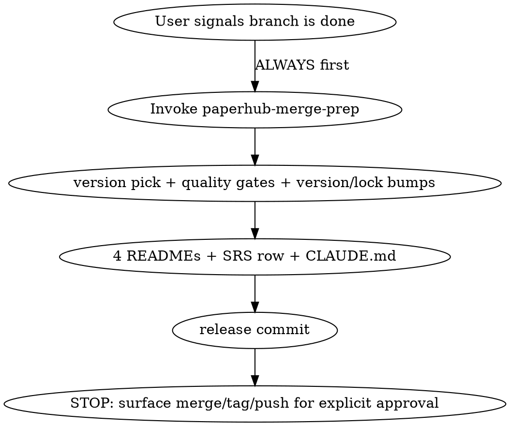

# Finishing a development branch (PaperHub)

This **overrides** the generic `superpowers:finishing-a-development-branch`
for this repo. The generic skill verifies tests and offers merge/PR/keep/
discard — but it does NOT know about PaperHub's release-file updates (the four
README locales' badges + citation, the three coupled version manifests + their
lockfiles, the SRS revision-history row, the CLAUDE.md version pointers). When
finishing was done through the generic skill alone, those files were missed
(the v2.34.0 release shipped with stale READMEs until caught).

## The rule

**Do NOT finish a PaperHub branch — merge, PR, tag, or push — until
`paperhub-merge-prep` has run and its file updates are committed.**

## Steps

1. **Invoke `paperhub-merge-prep`** (the Skill tool) and follow it end to end.
   It owns: branch-state check, version bump pick (patch/minor/major), the full
   quality-gate run (fresh test counts), the version manifest + lockfile bumps
   for all three packages, the four README locale updates, the SRS revision
   row, the CLAUDE.md pointer bumps, the single release commit, and the hard
   STOP that surfaces the exact merge/tag/push commands for per-instance
   approval.
2. **Only after** merge-prep's release commit exists do the merge/PR/push
   happen — and those are restricted ops needing explicit user approval each
   time (merge-prep step 6 already enforces this). The generic finish's
   "merge / PR / keep / discard" menu is redundant with merge-prep here; don't
   run it separately.
3. **Never** call `superpowers:finishing-a-development-branch` directly for
   PaperHub release work — it omits the release-file updates above.

## Amend safety (carry-over)

Any commit fix-up during finishing obeys the **`safe-amend`** skill: never
amend a pushed commit (the user pushes out of band, so `git fetch` + a remote
check is mandatory before any amend) — stack a new commit instead.

## When this does NOT apply

Non-release branch hygiene with nothing to ship (e.g. discarding a throwaway
experiment, or a branch that never touched code/versioned files) can use the
plain finish options. When in doubt, run `paperhub-merge-prep` — it no-ops
safely if there's nothing to bump.
