<div align="center">


# PaperHub

**A paper-aware chat client where every cited sentence traces back to its source.**

Multi-agent tool routing · in-repo RAG knowledge base · agentic per-paper retrieval · a Citation Canvas that links every `[chunk]` back to the exact passage in the paper · a conference-grade Beamer slide pipeline with decoupled, editable speaker notes.


-success)


**English** · [日本語](README.ja.md) · [繁體中文](README.zh-TW.md) · [简体中文](README.zh-CN.md)

</div>

---

PaperHub is built **UX-first**. Every retrieved chunk has a clickable provenance trail, every generation step writes an audit row, and every chat turn is reconstructible from SQLite alone. A single chat interface routes each turn to the right specialist agent — paper search, paper Q&A, NL→SQL library stats, memory curation, or slide generation.

## ✨ What it does

🔎 Agentic retrieval · 🧷 Citation Canvas · 🌍 Your language · 📊 Library stats · 🧠 Memory · 🧭 Routing + tracing · 🌐 Discovery · 📎 Bring your own papers · 🖼️ Beamer slides · 🔱 Fork & rewind · ➗ Math · 💾 Any device · 🔌 MCP-native

<details>
<summary><b>What each one means →</b></summary>

<br>

- **🔎 Agentic retrieval.** A per-paper subagent navigates each paper's section TOC (not blind top-k); a flagship model synthesises across papers.
- **🧷 Citation Canvas.** Inline `[chunk:N]` markers link to the exact passage — click to highlight it in both the rendered HTML *and* the source PDF.
- **🌍 Your language.** Ask in Chinese, get Chinese — citations preserved; a remembered "always reply in X" overrides per-turn detection.
- **📊 Library stats.** "How many papers do I have?" → read-only SQL over a table allowlist, answered with the numbers *and* the SQL it ran.
- **🧠 Memory.** Facts/preferences persist per-chat or everywhere — with a safety gate, LLM conflict-**supersede**, and a Manager panel to edit/(de)activate.
- **🧭 Visible routing + tracing.** A badge shows which agent + model handled each turn; a trace panel replays every step from SQLite.
- **🌐 Discovery.** `paper_search` resolves even vague references ("that diffusion paper everyone cites") via web + Semantic Scholar.
- **📎 Bring your own papers.** Attach by arXiv ID, URL, or PDF — deduplicated + cached; a background **Marker** worker upgrades PDFs to real figures, captions, and equations→LaTeX.
- **🖼️ Conference-grade slides.** A grounded **Beamer deck** that **never cites a figure that doesn't exist**. Opt-in any-language speaker notes; **diff-edit one slide** by chat; ask about the **on-screen slide** without mutating the deck.
- **🔱 Fork & rewind.** Branch a new chat from any past message — prefilled, editable, not auto-sent. Forks carry over references, memories, and the deck, and **nest under their parent**.
- **➗ Math renders.** LaTeX (`$…$`, `$$…$$`) renders as real equations via KaTeX.
- **💾 Any device.** Sessions and their full record live in the backend, not the browser. Deleting a chat removes it everywhere (with Undo).
- **🔌 MCP-native.** The agent's tools are served over MCP (`/mcp`); external clients (Claude Desktop, Cursor) reach the same surface.

</details>

---

## 📸 Screenshots

**Grounded answers — every claim traces back to the source.**

| Citation Canvas → rendered HTML | Citation Canvas → source PDF |
| :---: | :---: |
| [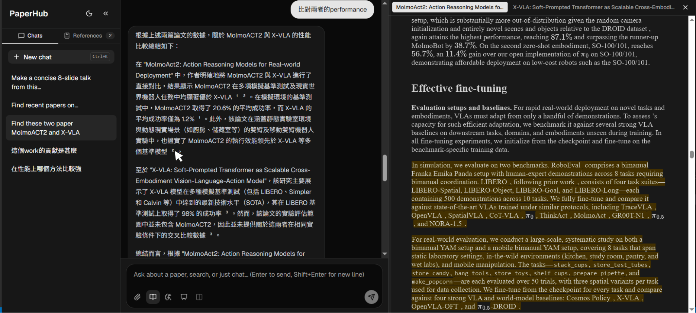](docs/screenshots/04-citation-canvas-html.png) | [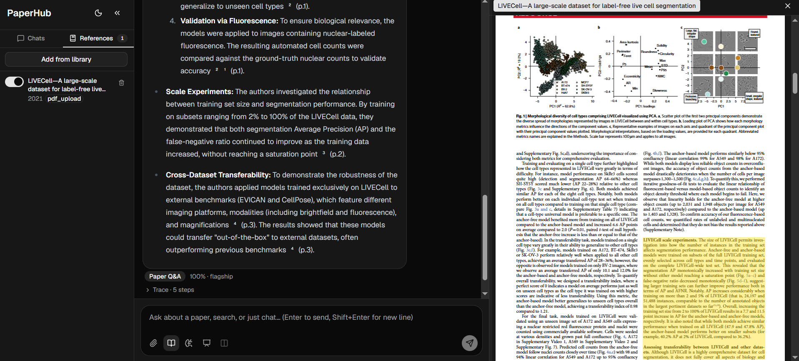](docs/screenshots/05-citation-canvas-pdf.png) |
| Click any `[chunk]` → scroll to + highlight the exact passage in the LaTeX-rendered HTML. | …and the same passage in the original PDF. No ungrounded claims. |

**Conference-grade slides — decoupled, opt-in notes.**

| Generate (slides only) | Speaker notes added on request |
| :---: | :---: |
| [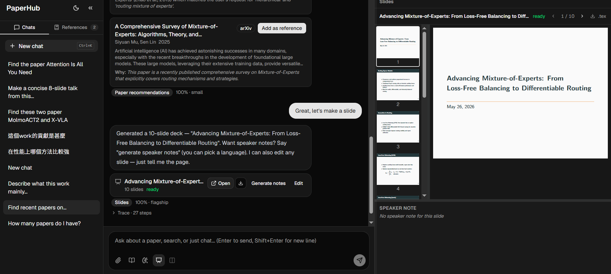](docs/screenshots/11-slides-generate.png) | [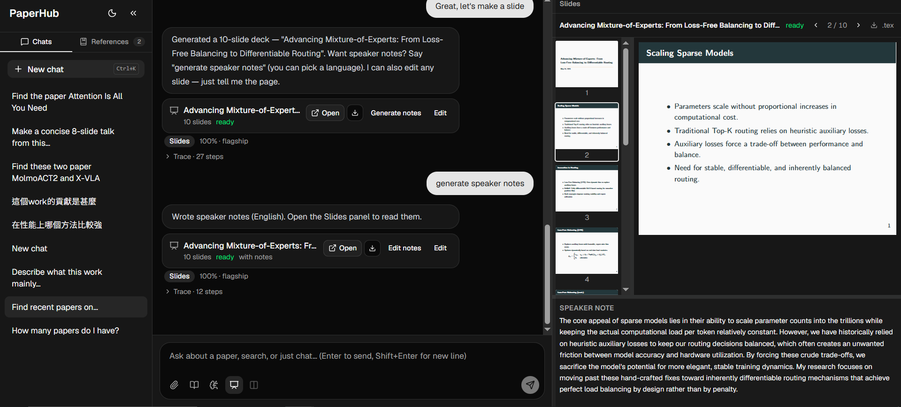](docs/screenshots/12-slides-notes-added.png) |
| A Beamer deck with real figures (no hallucinated graphics) — slides first, no notes. | Notes are an opt-in follow-up, authored separately (and in any language). |

**Library intelligence + memory.**

| NL→SQL library stats | Session + global memory |
| :---: | :---: |
| [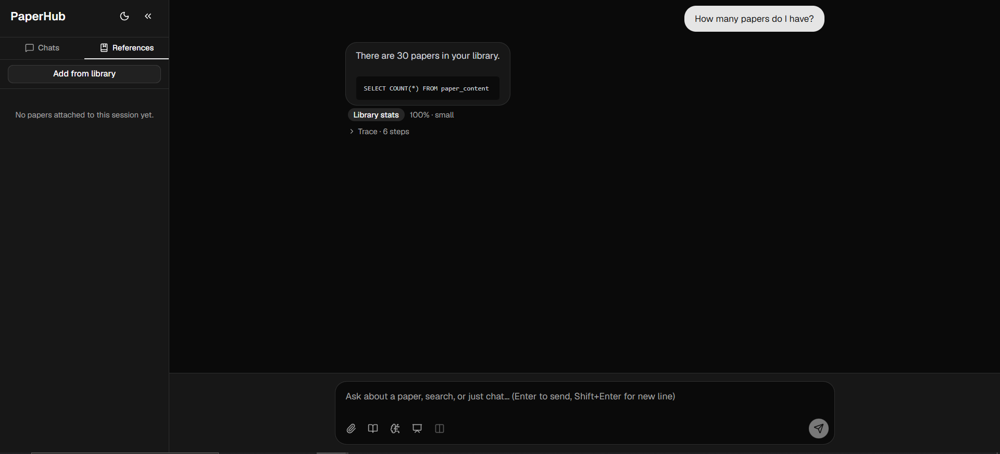](docs/screenshots/09-library-stats-sql.png) | [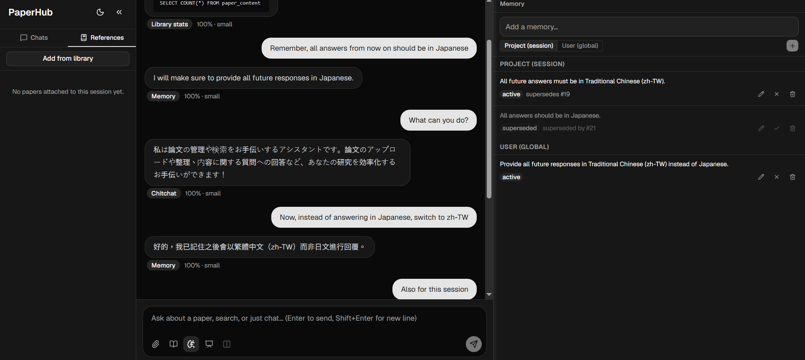](docs/screenshots/10-memory-manager.png) |
| "How many papers do I have?" → answered with the numbers **and** the exact SQL. | Remembered facts/preferences with a safety gate + conflict-supersede history. |

**Routing + observability.**

| Routing badge | Trace panel (replayable DAG) |
| :---: | :---: |
| [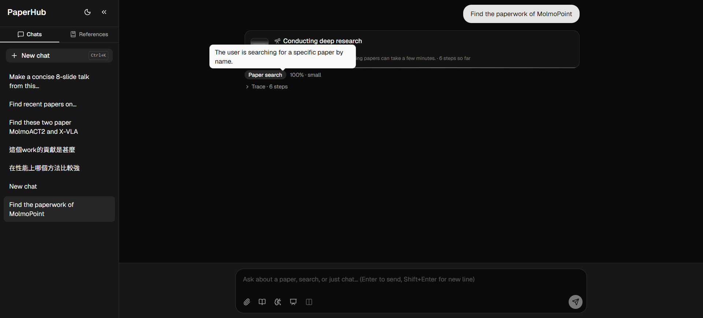](docs/screenshots/02-routing-badge.png) | [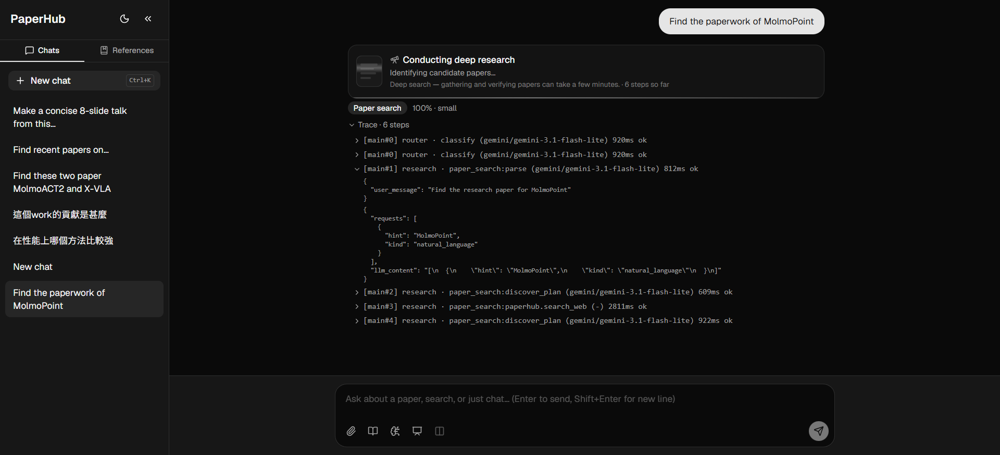](docs/screenshots/03-trace-panel.png) |
| Every turn shows which agent + model handled it. | Each model/MCP/pipeline step is an audit row — the full DAG replays from SQLite. |

**Discovery + bringing your own papers.**

| Paper search cards | Reference Sources drawer |
| :---: | :---: |
| [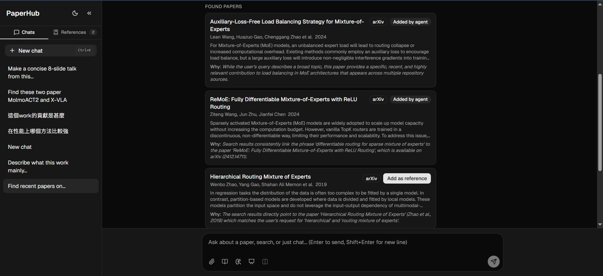](docs/screenshots/07-paper-search-cards.png) | [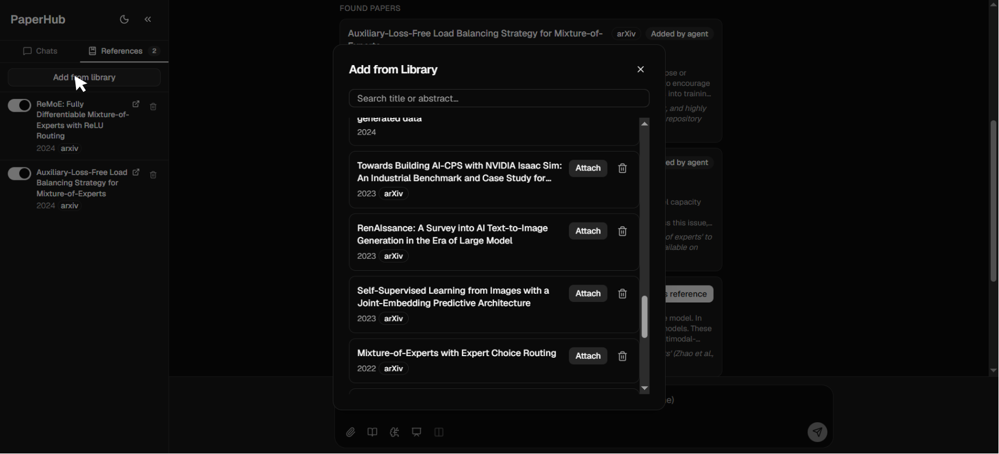](docs/screenshots/08-reference-sources.png) |
| Discovery via web + Semantic Scholar; the agent auto-adds its best picks. | Session-scoped reference set with per-paper enable/remove. |

<details>
<summary>More — app overview &amp; answering in your language</summary>

| The shell | Answers in your language |
| :---: | :---: |
| [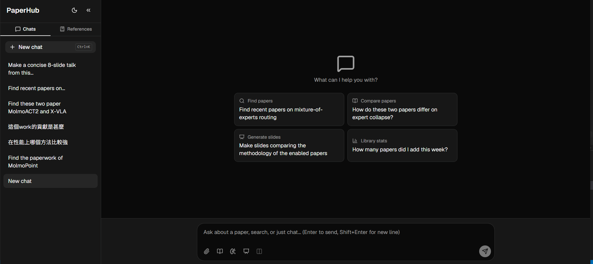](docs/screenshots/01-app-overview.png) | [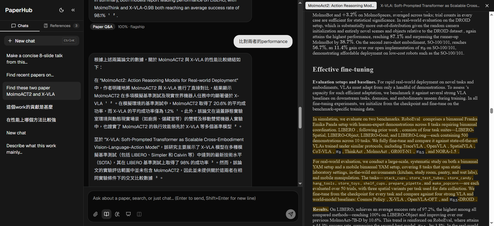](docs/screenshots/06-language-adherence.png) |
| One chat shell; every turn routed to a specialist agent. | Ask in any language — the answer follows, citations preserved. |

</details>

---

## 🧱 Tech stack

| Area | Choice |
| --- | --- |
| **Backend** | Python 3.11 · FastAPI · LangGraph · LiteLLM · SQLite (`aiosqlite`) · Pydantic v2 |
| **Frontend** | TypeScript · React 19 · Vite · Tailwind · Zustand · `react-markdown` + KaTeX |
| **Retrieval** | SQLite `chunks` table — agentic section navigation via `list_sections`/`read_section` (no vector store) |
| **Slides** | Beamer + `pdflatex` (`metropolis` theme) · `datalab-to/marker` PDF ingestion as a docker-compose service (optional, GPU-aware) |
| **LLM** | Gemini by default (any LiteLLM provider — small-tier subagents, flagship finalizer) |
| **Tooling** | `uv` · `pytest` · `ruff` · `mypy --strict` · Vitest · ESLint · Conventional Commits |

> [!NOTE]
> Local-only, single-user. No auth surface — point it at your own LLM key and run it on your machine.

---

## 🚀 Quick start

### 🐳 Run with Docker (recommended — just use the app)

If you want to *run* PaperHub rather than develop it, the whole stack runs in containers — **no Python, Node, or LaTeX to install**. You only need [Docker](https://docs.docker.com/get-docker/) and an LLM key. One `docker compose up` brings up all five services (backend, model-server, Marker PDF ingestion, web-search, and the web UI), so slides (incl. **Chinese/CJK**), RAG, and web discovery all work out of the box.

```bash
git clone https://github.com/whats2000/PaperHub.git
cd PaperHub
cp backend/.env.example backend/.env   # then fill in GEMINI_API_KEY (or your provider's key)

docker compose up -d --build           # CPU; first build downloads TeX Live + Marker weights (a few GB, once)
```

Open **http://localhost:8080**.

> [!NOTE]
> **GPU (optional, NVIDIA + [Container Toolkit](https://docs.nvidia.com/datacenter/cloud-native/container-toolkit/latest/install-guide.html)):** faster Marker PDF ingestion. Layer the GPU override:
> ```bash
> docker compose -f docker-compose.yml -f docker-compose.gpu.yml up -d --build
> ```

Data persists in named volumes (`paperhub-workspace` = DB + caches, model weights, Marker weights). `docker compose down` stops it; add `-v` to wipe the data too.

---

### 🛠️ Run from source (for development)

**Prerequisites:** Python 3.11 + [`uv`](https://docs.astral.sh/uv/), Node 18+, and an LLM API key (Gemini by default). **Slide generation** additionally needs a LaTeX distribution on `PATH` (`pdflatex` — e.g. `winget install MiKTeX.MiKTeX`); without it, only the `slides` intent is affected (it returns an "install a LaTeX distribution" message). PDF figure/equation extraction can optionally use the Dockerized `marker` service (`docker compose up -d marker`).

```bash
git clone https://github.com/whats2000/PaperHub.git
cd PaperHub

# Install both halves
cd backend && uv sync          # Python deps from uv.lock
cd ../frontend && npm install  # JS deps from package-lock.json
```

Configure your LLM key:

```bash
cd backend
cp .env.example .env           # then fill in GEMINI_API_KEY (or your provider's key)
```

#### Run the dev stack

**Recommended (Windows, one command):** `scripts/start.ps1` orchestrates all
the sibling processes — it brings up the external MCP daemons (open-websearch)
via `paperhub-mcp-up`, then the backend with hot-reload:

```powershell
# Terminal 1 — backend stack (MCP daemons + FastAPI on :8000)
cd backend
.\scripts\start.ps1
```

```bash
# Terminal 2 — frontend (Vite + React, hot-reload, :5173)
cd frontend
npm run dev
```

Open **http://localhost:5173** and start chatting.

<details>
<summary>Lower-level: run uvicorn directly</summary>

```bash
cd backend
uv run uvicorn paperhub.app:app --reload --reload-dir src --port 8000
```

Note: this path does **not** start the web-search daemon for you. On Windows,
`uvicorn --reload` runs on a `SelectorEventLoop`, so the in-worker autostart
falls back gracefully (papers-only) — bring web search up yourself with
`uv run paperhub-mcp-up` (or use `scripts/start.ps1`, which does it). See the
web-search note under [Configuration](#️-configuration).

</details>

> [!TIP]
> **No API key handy?** Exercise the chat plumbing with mocked LLMs (PowerShell):
> ```powershell
> $env:PAPERHUB_ROUTER_MOCK   = '{"intent":"chitchat","model_tier":"small","confidence":0.9,"reasoning":"dev"}'
> $env:PAPERHUB_CHITCHAT_MOCK = "Hello from PaperHub!"
> uv run uvicorn paperhub.app:app --reload --reload-dir src --port 8000
> ```

---

## ⚙️ Configuration

All settings live in `backend/.env` (grouped by function in [`.env.example`](backend/.env.example)). The ones you'll likely touch:

| Variable | Purpose | Default |
| --- | --- | --- |
| `GEMINI_API_KEY` | LLM provider credential (or `OPENAI_API_KEY` / `ANTHROPIC_API_KEY`) | — |
| `PAPERHUB_PAPER_QA_MODEL` | Flagship finalizer (cross-paper synthesis) | `gemini/gemini-2.5-pro` |
| `PAPERHUB_PAPER_QA_SUBAGENT_MODEL` | Per-paper section navigator (lightweight) | `gemini/gemini-3.1-flash-lite` |
| `PAPERHUB_SEMANTIC_SCHOLAR_API_KEY` | Higher Semantic Scholar rate limit (optional) | — |

**Web-search discovery (optional).** `paper_search` / `paper_suggest` gain a no-key multi-engine discovery step when an [`open-websearch`](https://www.npmjs.com/package/open-websearch) daemon is reachable on `:3000`. You don't install it by hand — `scripts/start.ps1` (or `uv run paperhub-mcp-up`) reads `mcp_servers.toml` and launches every `launch`-declaring MCP server for you via `npx -y`, which fetches the package on first run (~25s, one-time):

```bash
cd backend
uv run paperhub-mcp-up          # launches open-websearch on :3000 (skips if already up)
```

When it's up, the backend's MCP registry auto-exposes `web.search` / `web.fetch`. When it's down, the agent falls back to a papers-only flow — no config needed. Spawned daemons are detached so they survive backend `--reload`; explicit teardown is `start.ps1`'s job (otherwise they clear at reboot). Requires Node 18+ on `PATH`. (The `paperhub-papers` MCP surface ships in-process at `/mcp`; no install required.)

---

## 🗺️ Architecture (one screen)

```
┌─────────────────┐       SSE      ┌───────────────────────────────────────────┐
│  React shell    │ ◄───────────── │ FastAPI · POST /chat                      │
│  - Composer     │                │  ┌─────────────────────────────────────┐  │
│  - Routing badge│                │  │ LangGraph turn                      │  │
│  - Trace panel  │                │  │  Router ─► chitchat | paper_qa |    │  │
│  - Citation     │                │  │           paper_search | slides |   │  │
│    Canvas       │                │  │           library_stats             │  │
└─────────────────┘                │  └─────────────────────────────────────┘  │
                                   │     │                                     │
                                   │     ▼  paper_qa: fan out one subagent     │
                                   │        per paper → section nav →          │
                                   │        flagship finalizer over raw chunks │
                                   │  ┌─────────┐ ┌────────────────────────┐   │
                                   │  │ LiteLLM │ │ SQLite (chunks + audit │   │
                                   │  │ adapter │ │ + schema)              │   │
                                   │  └─────────┘ └────────────────────────┘   │
                                   └───────────────────────────────────────────┘
```

Every model call, MCP call, and pipeline step writes a `tool_calls` row before returning — enough state to reconstruct the full agent context from `SELECT * FROM tool_calls WHERE run_id = ?` alone. Paper content is **deduplicated**: one `paper_content` row + one cache dir + one set of chunks per unique paper, regardless of how many sessions reference it.

Full architecture lives in the [SRS](docs/superpowers/specs/2026-05-17-paperhub-srs.md).

---

## 📍 Status

| Plan | Scope | State |
| --- | --- | --- |
| **A** | Backend foundation + Router-only chat | ✅ complete |
| **B** | Frontend foundation (React shell, SSE, routing badge, trace panel) | ✅ complete |
| **C** | Paper Pipeline + Research Agent (ingest, paper_search, agentic paper_qa, MCP layer, PDF upload) | ✅ complete — merged (SRS v2.10) |
| **D** | Search results + Reference Sources + Citation Canvas (HTML + PDF passage highlighting) | ✅ complete — merged (SRS v2.13) |
| **E** | SQL Agent + `library_stats` (sqlite MCP) + session/global memory governance (gate, conflict-supersede, Memory Manager UI) | ✅ complete — merged (SRS v2.17) |
| **F** | Slide Pipeline + Report Agent — Marker ingestion (F2/F2.1), PhD-grade slide agent (F3), decoupled opt-in notes + diff-editing + length budget (F4), conference-grade metadata title page + title/style customization (F4.2) | ✅ complete — merged (SRS v2.22) |
| **F5** | Slide presentation mode (audience pop-up window + `BroadcastChannel` sync + presenter cockpit) + Q&A-during-talk + composer voice input | ✅ complete — merged (SRS v2.26) |
| **G** | Frontend UI internationalization (i18n: `en` / `zh-TW` / `zh-CN` / `ja`) + account menu (language / theme switcher, About) + DB-backed runtime Settings panel | ✅ complete — merged (SRS v2.31) |
| **H** | Compare view + filesystem / `paperhub.*` MCP | 🔜 planned |

Each plan ships working, testable software on its own. Plans live under [`docs/superpowers/plans/`](docs/superpowers/plans/).

---

## 🧑‍💻 Development

PaperHub is built spec → plan → TDD, with subagent-driven implementation and per-task spec-compliance + code-quality review.

**Backend gates** (from `backend/`):

```bash
uv run pytest          # 1104 tests, hermetic
uv run ruff check src tests
uv run mypy src        # --strict
```

**Frontend gates** (from `frontend/`):

```bash
npm test               # Vitest + RTL + MSW (386 tests)
npm run typecheck      # tsc --strict
npm run lint           # ESLint flat config
npm run build          # Vite production build
```

**Replay any past chat turn** from SQLite (debugging the agent flow):

```bash
cd backend
uv run paperhub-replay --run-id 1
```

**End-to-end benchmark** — `pytest` proves the wiring; the [`backend/benchmark/`](backend/benchmark/) harness proves the *behaviour*. It drives the **live** backend as a simulated user (attach cached papers → route prompts through `/chat`), collects grounding evidence (cited chunk text + agent trace), and scores each case **0/1** on correctness + grounding — by hand or via an **LLM-as-Judge** (fixed temperature, strict grounding). Cases are config-driven (TOML), so you can write your own:

```bash
# with the backend running (scripts/start.ps1), from backend/:
scripts/run-benchmark.ps1 -Judge            # 20-case eval (16 paper_qa + 4 slides) + LLM judge
scripts/run-benchmark.ps1 -Resume <prior.json>   # retry only failed cases after a drop
```

> Contributing AI agents: read [CLAUDE.md](CLAUDE.md) first — it carries the conventions, the fix-now policy, and the agent-flow observability rules.

---

## 📂 Repository layout

```
.
├── backend/
│   ├── src/paperhub/         # FastAPI app · agents · pipelines · mcp · tracer
│   ├── tests/                # pytest suite (1104 tests, hermetic)
│   ├── benchmark/            # config-driven real-API e2e benchmark + LLM-as-Judge
│   └── pyproject.toml        # uv project · mypy --strict · ruff
├── frontend/                 # React 19 + Vite + Tailwind + Zustand
├── docs/superpowers/
│   ├── specs/                # SRS — authoritative architecture document
│   └── plans/                # implementation plans, one per sub-project
├── reference/                # copied source from paper2slides-plus + Intro2GenAI-hw1
├── CLAUDE.md                 # AI-agent orientation for this repo
└── README.md
```

`workspace/` (gitignored) holds runtime state — the SQLite database and the papers cache.

---

## 📖 Documentation

- **[System Requirements Specification](docs/superpowers/specs/2026-05-17-paperhub-srs.md)** — authoritative architecture, schema, scope, and acceptance criteria (shipped through **v2.37.1**).
- **[Implementation plans](docs/superpowers/plans/)** — one per sub-project, each executed via TDD.
- **[Backend developer docs](backend/README.md)** — backend-specific notes.

---

## 📚 Citation

If you use PaperHub in your research or build on it, please cite it:

```bibtex
@software{paperhub,
  author  = {Ren-Di, Wu},
  title   = {{PaperHub: A Provenance-First Multi-Agent Research Assistant for Grounded Paper Q\&A and Slide Generation}},
  year    = {2026},
  url     = {https://github.com/whats2000/PaperHub},
  version = {2.37.1}
}
```

---

## 📄 License

[Apache License 2.0](LICENSE) — © PaperHub contributors. You may use, modify, and distribute this software under the terms of the license, which includes an express grant of patent rights from contributors.
