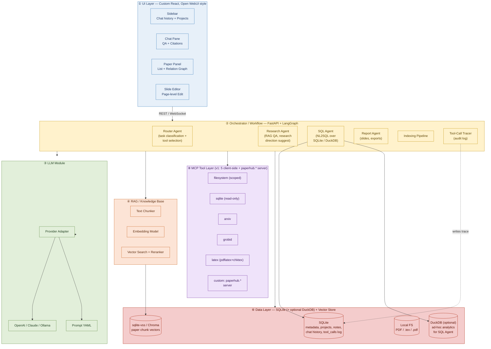
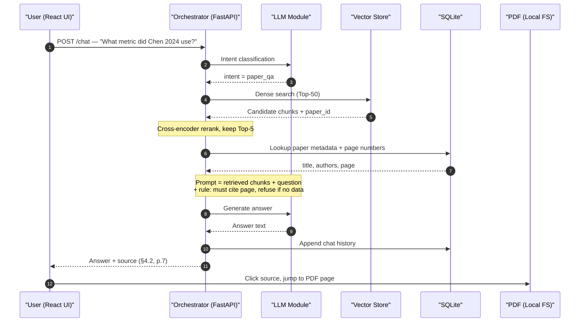

# PaperHub

**Paper Knowledge Base & Research Assistant System**

*Software Requirements Specification (SRS) · Technology Selection · Architecture Design*

| Field | Value |
| --- | --- |
| Version | v1.8 |
| Date | May 2026 |
| Predecessor | [paper2slides-plus](https://github.com/whats2000/paper2slides-plus) |

---

## Revision History

| Version | Date | Summary |
| --- | --- | --- |
| v1.0 | 2026-05-03 | Initial release covering all three parts. |
| v1.1 | 2026-05-03 | UI switched from Streamlit to custom React (Open WebUI style); data layer simplified from four components (Postgres + Qdrant + MinIO + Redis) to two (SQLite + vector store); architecture diagrams rendered with Graphviz. |
| v1.2 | 2026-05-17 | Repositioned as a **multi-model and tool-routing AI platform**: orchestrator refactored into a Router Agent + Research / SQL / Report sub-agents; added NL2SQL over SQLite (with optional DuckDB analytics view); added MCP tool integration (filesystem, SQLite, web search) with explicit tool descriptions and security boundaries; added traceable tool-call audit log; added a model/tool comparison evaluation harness wired into CI as a regression gate. |
| v1.3 | 2026-05-17 | **Merged §⑤ External APIs and §⑧ MCP Tool Layer.** Every external integration except the LLM provider adapter is now exposed as an MCP tool: bibliographic APIs (`arxiv`, `semantic_scholar`, `crossref`, `web_search`), local deterministic tools (`grobid`, `latex`), and existing `filesystem` / `sqlite` — eight client-side MCP tools total, plus a richer `paperhub.*` server-side tool surface (`search_library`, `get_paper`, `find_related`, `summarize_paper`, `compose_slides`, `list_runs`, `get_trace`). This gives every external call uniform tracing, uniform scope-checking, and uniform exposure to external MCP clients (Claude Desktop, Cursor). LLM providers stay separate because their hot-path streaming / structured-output interface doesn't map cleanly onto MCP. |
| v1.4 | 2026-05-17 | **Design-review fixes.** Tightened measurable acceptance criteria (#2 rewritten against a seeded intra-library citation graph; #3 refusal target relaxed from 100% → ≥95% on a defined 20-question OOD set), split **NFR-01** performance targets into warm-cache vs cold-start budgets, added an **FR-12 answer-quality rubric** (LLM-as-judge with κ-validated rubric prompt) so the model-comparison bullet is concretely measurable, added a **NFR-11 narrow exception** for upstream LangGraph / MCP SDK type-stub gaps (per-error-code `# type: ignore` only), dropped multi-user language from §④ (single-user product per Out-of-Scope §7), changed the two-stage RAG funnel to `top-min(50, ⌈corpus_size / 3⌉)` so it behaves sensibly on small libraries, added FR-05 hard cap (≤ 20 generated pages per slide run), and clarified the DuckDB-over-SQLite mechanism (read-only `ATTACH ... TYPE SQLITE` rather than a unified view). No FR additions, no scope cuts. |
| v1.5 | 2026-05-17 | **MCP bill-of-materials: reuse-first.** §⑧ MCP Tool Layer table gains a **Provenance** column declaring per-tool whether PaperHub reuses an existing community MCP server, wraps an existing client in a thin custom MCP server, or builds one from scratch — survey across `modelcontextprotocol/servers`, npm, PyPI, and community lists (May 2026). Result: **3 reuse** (`filesystem` via `@modelcontextprotocol/server-filesystem` pinned post-CVE-2025-53109/53110, `arxiv` via `blazickjp/arxiv-mcp-server`, `semantic_scholar` via `zongmin-yu/semantic-scholar-fastmcp`), **4 thin wraps** (`sqlite` for the table allow-list + aggregated `schema()` method, `web_search` for the domain allow-list, `crossref` because no maintained server exists, `grobid` for PDF-path sandboxing), **1 build-from-scratch** (`latex` — none expose `chktex` + workspace sandbox), plus the always-custom `paperhub.*` server. Tool capabilities and scope boundaries are unchanged; the FR-10 implementation strategy is now "configure and constrain existing servers" rather than "write 8 servers from scratch." No FR, NFR, UC, or acceptance changes. |
| v1.6 | 2026-05-17 | **Scope simplification + LLM-client consolidation.** **(1) MCP surface shrinks 8 → 5 client-side tools**: keep `arxiv` (PDF + metadata — essential for RAG), `grobid` (structured references), `latex` (slides), `filesystem`, `sqlite`. Drop `semantic_scholar`, `crossref`, `web_search` for v1 — citation graph (FR-02) now sourced exclusively from GROBID-extracted references; DOI import path (FR-01) drops to v2; research-direction (FR-04) works from local-library topic clustering only. **(2) LLM client = LiteLLM**: replace the would-be hand-rolled `AnthropicAdapter` / `OpenAIAdapter` with a thin wrapper over `litellm.acompletion()`. Same `LlmAdapter` Protocol on top, but the provider plumbing (Anthropic / OpenAI / Ollama / structured output via `response_format={"type":"json_schema",...}`) is delegated to LiteLLM — drops ~200 LoC of provider-specific code and inherits LiteLLM's retry/fallback/cost-tracking for free. NFR-03's "providers must be pluggable" is satisfied by LiteLLM's 100+ provider matrix rather than our own adapter pattern. **(3) Implementation phasing compressed 9 → 3** in the companion design doc (no SRS bearing — the phase split was always a build-order detail, not a requirements detail). Acceptance #10 updated for the new 5-tool MCP surface. No FR, NFR, or use-case removals; the dropped MCP tools were never user-visible features. |
| v1.7 | 2026-05-17 | **First principle: preserve paper2slides-plus capabilities.** Added **§1.1 First Principle** stating that modernizing the framework must not destroy working logic the predecessor already delivered. Concretely: arXiv papers MUST be imported with their **LaTeX source preserved** (via [`takashiishida/arxiv-latex-mcp`](https://github.com/takashiishida/arxiv-latex-mcp) — the markdown-only HTML conversion path used by `blazickjp/arxiv-mcp-server` silently destroys equations, figures, and citation labels, which would break the FR-05 / FR-07 slide-generation pipeline downstream). Required updates: **FR-01** gains a "primary artifact format" clause — for arXiv sources the primary artifact is the `.tex` (or `.tar.gz` of e-print archive); a converted text rendition (markdown) may be stored alongside for RAG indexing but is secondary. **FR-10** §⑧ MCP table replaces `arxiv` (blazickjp/arxiv-mcp-server, markdown) with `arxiv_latex` (takashiishida/arxiv-latex-mcp, full LaTeX); markdown-rendition tooling, if kept, is for RAG-only consumption. **MCP count stays 5** (just swapping the upstream pin). No FR additions, no FR removals; the requirement was always implicit in the predecessor name (`paper2slides-plus`) and the FR-05 contract, now explicit so future framework swaps can't drop it again. |
| v1.8 | 2026-05-17 | **High-fidelity PDF extraction via Marker + sharpened §1.1 principle.** (1) Extends the §1.1 source-fidelity clause to local-PDF / DOI imports: when no LaTeX source is available, the extractor is [`datalab-to/marker`](https://github.com/datalab-to/marker) — a high-fidelity PDF→Markdown converter that preserves equations, tables, figures. Lower-fidelity paths (`pdfminer`, raw `PyMuPDF` text) are prohibited as primary; GROBID is restricted to *reference-list* extraction (its actual strength), not body text. (2) **Sharpened §1.1 clause 2** from "no silent feature removal" to **"no feature removal at all — improve, don't simplify"**: every capability paper2slides-plus shipped MUST be present in PaperHub, possibly faster or with better fidelity, but never reduced. Concrete updates: **FR-01** primary-artifact rule extended to local-PDF (PDF primary; Marker-extracted Markdown + figures + equation captures secondary, stored under `workspace_root/papers/<id>/marker/`). **§⑧ MCP table** gains **`pdf_extract`** (build-from-scratch wrap over Marker). **MCP count grows 5 → 6**. Marker is heavyweight (~2–4 GB ML models, GPU-friendly but CPU-capable); installed as optional `[pdf]` extra, with a low-fidelity fallback that flags `papers.notes_md='low_fidelity_extraction'` when Marker is absent. No FR or acceptance removals. |

---

# Part 1 — Software Requirements Specification

## 1. Project Background

Modern researchers must read dozens to hundreds of academic papers each year, and the relationships among them — citations, methodological lineage, topical evolution — are notoriously complex. Mainstream reference managers such as Zotero and Mendeley excel at bibliographic organization and PDF annotation, but provide no cross-paper semantic linking and no tooling for research-direction exploration. Existing academic LLM products (e.g. SciSpace, Elicit) can answer questions about a single paper, but they cannot integrate a user's personal reading history into a persistently queryable knowledge base.

This project extends the author's previous open-source work, **paper2slides-plus** (a tool that converts a single paper into a Beamer presentation), into a modular research-assistant platform. On top of the original "paper → slides" flow, **PaperHub** adds indexing, cross-paper relation analysis, semantic Q&A, research-direction suggestion, and multi-paper integrated slide generation — enabling users to complete the full research loop ("read papers → manage papers → explore directions → produce reports") inside a single system.

Beyond the research-assistant use case, PaperHub also serves as a concrete reference implementation of a **multi-model and tool-routing AI platform**. A single user task may require very different capabilities — paper retrieval, structured-database querying, report generation, or external MCP tool calls — and no single model or tool is best at all of them. PaperHub therefore exposes an explicit **Router Agent** that classifies the incoming task, picks an appropriate sub-agent (Research / SQL / Report) and the right model tier, invokes the chosen tools (vector search, NL2SQL over SQLite/DuckDB, MCP servers, LaTeX compiler), and records every routing decision in a traceable audit log. PaperHub is intended as a **complete production system**, not a course demo: the routing-quality, source-citation, SQL-executability, and trace-reproducibility properties below are continuous quality bars that every release must clear via the CI-gated evaluation harness, not one-off targets to hit at a final presentation.

## 1.1 First Principle — Preserve paper2slides-plus Capabilities

> **Modernizing the framework MUST NOT destroy working logic the predecessor already delivers.**

PaperHub is a rewrite of [`paper2slides-plus`](https://github.com/whats2000/paper2slides-plus) on a modern stack (FastAPI + LangGraph + LiteLLM + React + MCP). The rewrite is justified by the new capabilities it enables (Router-Agent routing, multi-paper knowledge base, RAG QA, eval harness), not by reducing what came before. Every capability the predecessor shipped — most importantly, **converting a single arXiv paper into a high-fidelity Beamer slide deck with equations and figures intact** — must be at least as good in PaperHub as it was in paper2slides-plus.

Concrete enforcement:

1. **Source-format fidelity at import time — LaTeX always wins; Marker is the universal PDF fallback.** Extractor selection follows this strict priority ladder; the import pipeline tries each in order and only falls through on failure:

   1. **arXiv ID provided AND LaTeX e-print retrievable** → primary artifact = `.tex` (unpacked from the e-print `.tar.gz`), extracted via [`takashiishida/arxiv-latex-mcp`](https://github.com/takashiishida/arxiv-latex-mcp). This is the preferred path because it preserves authors' original equations, figures, tables, and citation labels lossless.
   2. **arXiv ID provided BUT LaTeX e-print missing / withdrawn / fetch failed** → fall back to step 4 (Marker on the arXiv PDF). Mark `papers.notes_md='latex_unavailable_fell_back_to_pdf'` so the slide pipeline knows the artifact is a post-extraction Markdown rather than the original source.
   3. **DOI provided AND it resolves to an arXiv preprint** → resolve to the arXiv ID and go to step 1 (LaTeX-first).
   4. **PDF available (local upload, or any of the fallback paths above)** → primary artifact = the PDF; extracted via [`datalab-to/marker`](https://github.com/datalab-to/marker) (high-fidelity PDF→Markdown preserving equations, tables, figures). Secondary artifact = Marker's `.md` + figure images + equation captures, saved under `workspace_root/papers/<id>/marker/`.
   5. **Nothing else** → import fails with a clear error. We do not silently downgrade to lossy extractors.

   Lower-fidelity converters (`pdfminer` raw text, HTML→Markdown, the body-text route of `blazickjp/arxiv-mcp-server`) are **prohibited as primary artifact sources** — they silently destroy equations, figure references, table structure, and citation labels, all of which the slide pipeline (FR-05 / FR-07) needs intact. GROBID continues to be used for structured *reference list* extraction (FR-02), which is what it's actually good at; it is **not** a body-text extractor in PaperHub.

   **Rationale for the LaTeX-first ladder:** paper2slides-plus already prefers LaTeX e-prints when generating slides because the source preserves macros, environments, and `\includegraphics` paths needed for high-quality Beamer output. PaperHub inherits this preference verbatim — Marker exists to handle the cases the predecessor couldn't (user-uploaded PDFs, withdrawn arXiv papers, non-arXiv DOIs), not to replace the LaTeX path.
2. **No feature removal — improve, don't simplify.** Every capability paper2slides-plus shipped MUST be present in PaperHub. There is no "we simplified that away," no "we don't need that in the new design," no "deferred to a future version" for capabilities the predecessor already delivered. **Improvements are encouraged** (better performance, higher-fidelity extraction, cleaner UX, more accurate outputs); **simplifications are prohibited** when they reduce the user-visible capability surface. Concretely, if paper2slides-plus could do X (single-paper Beamer-deck generation with equations + figures intact, page-level slide editing with on-the-fly recompile, the LaTeX feedback loop, prompt-driven section regeneration, etc.), then PaperHub MUST do X — possibly faster, possibly with a better UX, but never less. A design change that would drop or weaken any predecessor capability is a regression and must be either reversed or paired with a strictly-better replacement before merge. Each PR that touches a paper2slides-plus-inherited code path declares in its description which predecessor capabilities it preserves and (if applicable) how it improves them.
3. **Convergence, not replacement.** When a Phase A choice (e.g., "store only Markdown") is later discovered to compromise a Phase B / C feature, the fix is to extend Phase A's contract (add LaTeX storage now), not to defer the principle to "we'll fix it later."

This principle is binding on every revision of this SRS and every implementation phase. It is the lens through which design trade-offs are decided.

## 2. Problem Statement

Graduate students and independent researchers commonly face the following five pain points in their literature workflow:

- **Information fragmentation.** PDFs, notes, and citation lists are scattered across multiple tools; previously-read papers are hard to relocate.
- **Invisible relationships.** Method inheritance, conceptual evolution, and dataset overlap between papers exist only in the researcher's head and cannot be queried.
- **Hard-to-explore research directions.** When entering a new field, there is no tool to help map "where the gaps lie" relative to what the user has already read.
- **Time-consuming slide preparation.** Before lab meetings or defense rehearsals, users must manually consolidate multiple papers into a single deck, with high duplication of effort.
- **LLM hallucination risk.** Asking a general-purpose LLM about paper details often results in fabricated citations or numbers — unacceptable in academic contexts.
- **Opaque tool / model selection.** When the same chat box can answer a paper-content question, run an SQL aggregation over the user's library, *and* call an external MCP tool, users (and graders) cannot tell whether the agent picked the right capability for the job, or whether a wrong answer was caused by the model, the prompt, or the wrong tool being invoked.
- **Non-reproducible agent runs.** Without a structured log of *which model / which tool / which arguments* were used at each step, multi-agent answers are impossible to audit, debug, or compare across runs.

## 3. Stakeholders and User Roles

| Role | Category | Primary Concerns |
| --- | --- | --- |
| Graduate student (primary user) | End user | Quickly locate previously-read papers; produce research progress reports; explore new directions. |
| Independent researcher / self-learner | End user | Absorb knowledge across domains; lower reading friction; organize shareable outputs. |
| Faculty advisor | Indirect user | Review the student's reading trajectory and research narrative (via exported slides). |
| System administrator | Operations | API-key management, model cost control, backup of the local SQLite file. |
| LLM / Embedding providers | External dependency | Supply generation and vectorization capability (OpenAI, Anthropic, local Ollama, etc.). |
| arXiv / Semantic Scholar | External dependency | Provide paper metadata, PDFs, and citation graph data. |

## 4. Use Cases

### UC-1: Add a paper and build its index

A master's student in NLP, Alex, sees a new paper about RAG evaluation on arXiv. He pastes the link into PaperHub. The system automatically downloads the PDF, extracts the title and abstract, generates semantic embeddings, identifies the reference list, and returns a graph showing how this new paper relates to existing ones in his library — revealing that the paper inherits methodology from five papers he has previously read. The entire flow completes within 30 seconds.

### UC-2: Ask questions about paper details

While preparing a lab meeting, Alex wants to confirm "did the paper I read last week use BLEU or ROUGE for evaluation?" He types in the PaperHub chat: *"What evaluation metric did Chen 2024 use in their RAG paper?"* The system retrieves relevant passages via RAG, asks an LLM to compose the answer, and annotates the response with *"Source: §4.2, p.7"*. If no matching content exists in the database, the system explicitly replies "No relevant information found in the indexed papers" rather than fabricating an answer.

### UC-3: Research-direction suggestion and multi-paper slide generation

Alex needs to present his progress to his advisor next week. He opens the **Research Direction Exploration** mode in PaperHub and enters the keyword *"low-resource RAG evaluation."* Combining 12 related papers from his library, the system lists three sub-topics that remain under-explored and tags the key papers supporting each. Alex picks the three most promising and clicks **Compose Slides**. The system invokes the summarization, structure-planning, and Beamer-generation modules in sequence, and within 10 minutes produces a 15-page PDF deck containing background, a three-paper comparison table, identified research gaps, and a reference page.

### UC-4: Natural-language statistics over the library (NL2SQL)

Alex wants a quick reading-habit summary for his monthly report. He types into the same chat box: *"How many papers did I add in the past six months, broken down by primary topic? Show only topics with at least three papers."* The Router Agent classifies the question as a **structured-statistics** task and dispatches it to the **SQL Agent** instead of the RAG pipeline. The SQL Agent translates the question into a parameterized SQLite query against the `papers` and `tags` tables, executes it in read-only mode, formats the result as a small table, and replies with both the answer and the exact SQL it ran (folded under a "Show SQL" toggle). If the LLM emits invalid SQL, the system catches the database error, surfaces it to the LLM as feedback, and retries up to three times before failing loudly rather than fabricating numbers.

### UC-5: External MCP tool call with visible tool-routing trace

Alex pastes a colleague's pre-print URL into the chat and asks: *"Save this PDF to my `~/Papers/inbox` folder, then summarize section 3."* The Router Agent recognizes two sub-tasks: a **filesystem write** (handled by the MCP filesystem server) and a **paper summarization** (handled by the Research Agent). The UI's "Tool Trace" panel shows, step by step: `router → mcp.filesystem.write_file(path, bytes)` (✓ permission granted, scope = `~/Papers/inbox`), then `router → research_agent.summarize(section=3)`. Each step lists the tool name, the model used, the arguments (with secrets redacted), the latency, and the token cost. Alex can replay any single step in isolation for debugging, and the entire trace is persisted to the audit log table so the run is reproducible after the fact.

## 5. Functional Requirements

| ID | Name | Description |
| --- | --- | --- |
| **FR-01** | Paper import and indexing | Supports three import methods: arXiv ID, DOI, and local PDF. The system automatically performs download, text extraction, section chunking, embedding, and metadata ingestion. **Primary-artifact rule (per §1.1):** see the source-format matrix in §1.1 clause 1. Briefly — arXiv → LaTeX e-print (`arxiv_latex` MCP); local PDF → PDF + Marker-extracted Markdown/figures/equations (`pdf_extract` MCP wrapping [`datalab-to/marker`](https://github.com/datalab-to/marker)); DOI → publisher LaTeX if available, else Marker. Lower-fidelity extractors (raw `pdfminer` text, HTML→Markdown) are prohibited as the primary artifact source. The secondary Markdown/text rendition is what the chunker + embedder index into the vector store for RAG; the primary artifact is what the slide pipeline (FR-05/07) reads from. |
| **FR-02** | Cross-paper relation analysis | Computes a relation strength score along three dimensions — citation, semantic similarity, and author overlap — and renders the result as an interactive graph. |
| **FR-03** | Paper-detail Q&A (RAG) | Accepts natural-language questions, retrieves relevant passages, and generates answers with cited sources. |
| **FR-04** | Research-direction suggestion | Analyzes the topic distribution of the user's library, identifies research gaps, and outputs 3–5 candidate directions with supporting papers. |
| **FR-05** | Multi-paper integrated slides | Given N selected papers (hard cap: **≤ 5 input papers, ≤ 20 generated pages per run** — enforced as a rule before any LLM call so cost is predictable), generates a Beamer slide deck covering background, paper comparison, research gaps, and conclusions, then compiles to PDF. |
| **FR-06** | Tagging and project management | Users can create multiple research projects; each paper can be tagged, annotated, and assigned a reading status (unread / skimmed / deeply read). |
| **FR-07** | Interactive slide editing | Inherits the page-level editing mechanism from paper2slides-plus, allowing the user to regenerate or fine-tune individual slides with on-the-fly recompilation. |
| **FR-08** | Router Agent and task classification | A dedicated Router Agent classifies every incoming user task into one of a fixed set of intents (`paper_qa`, `library_stats`, `research_suggest`, `slides`, `mcp_tool`, `chitchat`), selects the matching sub-agent (Research / SQL / Report / Slide / MCP), and picks a model tier (small for routing/classification, flagship for generation). Classification confidence below a threshold falls back to asking the user to disambiguate. |
| **FR-09** | NL2SQL over the local library | The SQL Agent translates natural-language statistical questions ("how many papers about X in the past 6 months", "top 5 most-cited authors in my library") into parameterized SQL against the SQLite metadata schema (and optionally DuckDB for ad-hoc analytics). Queries execute in a **read-only** connection. The emitted SQL, the row count, and the execution time are surfaced in the UI; invalid SQL triggers a self-repair loop (max 3 retries). |
| **FR-10** | MCP tool integration | The system exposes MCP-compatible tools to the agents — at minimum: `filesystem` (sandboxed to a user-configured root), `sqlite` (read-only over the metadata DB), and `web_search`. Each tool ships with a structured description (purpose, arguments schema, scope/permission boundary). A custom MCP server demonstrating PaperHub-specific tools (e.g. `paperhub.find_related`) is also provided. |
| **FR-11** | Tool-call audit log and trace UI | Every agent step persists `(run_id, step_index, agent, tool, model, args_redacted, result_summary, latency_ms, token_in, token_out, status, error)` to a `tool_calls` SQLite table. A "Tool Trace" panel in the UI renders the full DAG for any run, supports single-step replay, and exports the trace as JSON for grading / reproducibility. |
| **FR-12** | Model and tool evaluation harness | A built-in evaluation harness runs a fixed task suite (paper_qa / library_stats / mcp_tool / mixed) across configurable model × tool-routing combinations, scoring all five dimensions below. Results are emitted as a regression-tracked comparison table; the harness runs in CI on every release using a recording LLM adapter (replayed fixtures, free, ~30 s) and can also be invoked manually with real APIs for the model-comparison report. **Scoring rubric:** (a) **Routing accuracy** — exact-match against gold intent labels on a ≥ 30-prompt held-out set spanning all 6 intents. (b) **Answer correctness** — LLM-as-judge using a fixed judge model (`claude-haiku-4-5` by default), a published rubric prompt scored 0–3 (3 = factually correct and complete; 2 = correct but partial; 1 = partially correct or misleading; 0 = wrong or hallucinated); the rubric must achieve Cohen's κ ≥ 0.7 against ≥ 20 human-scored items before it is accepted as the production judge, and the human-calibration set is checked in alongside the rubric prompt. (c) **Source-citation rate** — % of `paper_qa` answers that include at least one inline `(§section, p.page)` citation resolvable to an existing chunk row. (d) **SQL executability** — % of generated SQL that runs without error against the read-only connection on first attempt, and % that runs after the self-repair loop (≤ 3 retries); for the executable subset, % whose result rows match the gold result exactly. (e) **End-to-end latency and USD cost per task**, broken down by routing decision and model tier. |

## 6. Non-Functional Requirements

| ID | Category | Concrete Targets |
| --- | --- | --- |
| **NFR-01** | Performance | **Warm-cache budgets** (services up, model warm, network reachable, paper PDF already on disk *or* arXiv rate-limit window available): single-paper indexing ≤ 60 s end-to-end; RAG Q&A first-token latency ≤ 5 s; slide generation (≤ 5 papers, ≤ 20 pages) ≤ 15 minutes. **Cold-start budgets** (first run after boot, GROBID JVM warming, reranker model loading, network round-trip): single-paper indexing ≤ 3 minutes; first RAG Q&A first-token latency ≤ 15 s. The cold-start figures are documented separately so warm-cache acceptance tests are not flaky on a freshly-booted laptop. |
| **NFR-02** | Reliability | LaTeX compilation failures trigger an automatic feedback loop (max 3 retries); external API calls use exponential-backoff retry. |
| **NFR-03** | Extensibility | LLM providers must be pluggable (OpenAI, Anthropic, local Ollama); front-end and back-end are decoupled via REST so each can be replaced independently. |
| **NFR-04** | Data security | API keys are injected via environment variables only; the SQLite database is stored on the user's local machine and can be backed up in one click; no mandatory cloud dependency. |
| **NFR-05** | Usability | React UI in Open WebUI style (left: chat history sidebar; center: chat pane); bilingual zh-TW / en; no main feature is more than three clicks away. |
| **NFR-06** | Maintainability | Modular architecture with clear function boundaries; prompts centrally managed in YAML and independently versioned. |
| **NFR-07** | Cost control | Full pipeline cost per paper (index + slides) target ≤ USD 0.30; a usage dashboard is provided. |
| **NFR-08** | Routing accuracy | On a held-out task-classification set of ≥ 30 labeled prompts spanning all intents, Router Agent top-1 accuracy ≥ 75% (stretch goal: 85%). Calls that would invoke a *destructive* tool (e.g. filesystem write) outside its declared scope must be rejected by the orchestrator — this is enforced by rules, not by routing accuracy. |
| **NFR-09** | Auditability / reproducibility | Every chat turn produces a `run_id`; the full tool-call trace for any past `run_id` must be reconstructable from SQLite alone. Argument fields containing API keys or absolute home-directory paths are redacted before persistence. |
| **NFR-10** | MCP security boundary | Each MCP tool declares an explicit allow-list (filesystem root, table allow-list, URL domain allow-list). Calls outside the declared scope are rejected by the orchestrator *before* reaching the MCP server. |
| **NFR-11** | Strict typing | All Python interfaces — FastAPI request/response models, agent state, LangGraph node I/O, tool argument schemas, LLM structured outputs, and the `tool_calls` trace record — are declared with **Pydantic v2 `BaseModel`** (for validated runtime payloads) or **`TypedDict` / `dataclass`** (for in-process state). Use of `Any`, `object`, untyped `dict`, or bare `list` in public function signatures and module-level interfaces is **prohibited**; `dict[str, Any]` is allowed only at the I/O boundary with an external untyped source (e.g. a raw HTTP body) and must be parsed into a typed model before crossing one function call. The codebase passes `mypy --strict` (or `pyright` strict mode) in CI; new code that introduces `Any` is rejected. **Narrow upstream-boundary exception:** `# type: ignore[<specific-error-code>]` is permitted **only** when calling into LangGraph or the MCP SDK at a point where their published type stubs are themselves incomplete or incorrect; each occurrence must (a) cite the specific mypy error code in the comment, (b) be confined to a single statement (never a whole function or module), and (c) be tracked in a `KNOWN-TYPE-GAPS.md` register so they can be removed when upstream fixes ship. Bare `# type: ignore` with no error code is rejected by CI. |

## 7. Out of Scope

To keep the system's positioning clear and engineering effort focused, the following are explicitly **excluded** from this release:

- **No ghostwriting.** The system does not write paper sections on the user's behalf; it only summarizes, organizes, and inspires.
- **No active crawling.** The system does not autonomously fetch new arXiv papers for recommendation; users must import manually.
- **No experiment reproduction.** The system does not execute paper code or rerun experiments; all "data" comes from the paper text itself.
- **No peer review.** The system does not score papers for quality or rank them by academic value, to avoid bias.
- **No real-time multi-user collaborative editing.** Slide editing is single-user; Google-Docs-style live collaboration is not supported.
- **No paywall bypass.** The system processes only PDFs the user lawfully possesses and open-access papers.
- **No enterprise-grade database stack.** This release deliberately avoids PostgreSQL, MinIO, Redis, etc.; the data layer is a single SQLite file plus a vector store, to keep deployment frictionless.

## 8. Acceptance Criteria

The following criteria correspond to FR-01 through FR-12; all must pass for delivery:

1. Given 10 arXiv IDs imported sequentially with services already warm, **median per-paper indexing wall-clock ≤ 60 s** (excluding arXiv ToS rate-limit pauses, which are charged separately and reported), with metadata and embeddings persisted in SQLite. The same 10-paper batch must also complete end-to-end in ≤ 5 minutes inclusive of all rate-limit pauses.
2. Given a manually-seeded **intra-library citation ground-truth graph** over 50 papers (built by extracting reference lists with GROBID and confirming each edge whose target is also one of the 50 papers), the relation-analysis feature reports a relation edge for **≥ 80% of those ground-truth edges (recall)** with **≥ 70% precision on the union of all edges it reports**. The ground-truth file is checked in alongside the test so the measurement is reproducible.
3. On a 30-question RAG Q&A test set whose answers are verifiable against the indexed papers, answer accuracy ≥ 85% (judge-scored ≥ 2/3 per FR-12's rubric), with page-level source citation in 100% of accepted answers. On a separate 20-question **out-of-database** test set (questions about papers deliberately not indexed), **≥ 95% refusal rate**, where every refusal explicitly emits the string *"No relevant information found in the indexed papers."*
4. Run on three different topical subsets, the research-suggestion feature produces 3–5 directions each; ≥ 70% are rated "reasonable" by a domain expert.
5. Given three input papers, the integrated-slide feature successfully compiles to PDF with at least four sections: cover, background, paper comparison, conclusions.
6. The project-management UI handles ≥ 5 simultaneous projects; tag and note operations complete within 1 second.
7. Per-slide recompilation finishes within 30 seconds and does not affect other slides.
8. On the held-out routing test set (≥ 30 labeled prompts spanning all intents), Router Agent top-1 accuracy ≥ 75%; out-of-scope MCP calls (e.g. filesystem write outside the configured root) are rejected by the orchestrator in 100% of attempted cases.
9. On a 10-question NL2SQL test set, ≥ 70% of generated queries are executable on first attempt and ≥ 85% after the self-repair loop; for the executable subset, numeric answers match the gold result row-for-row.
10. All five v1 client-side MCP tools (`arxiv`, `grobid`, `latex`, `filesystem`, `sqlite`) are callable end-to-end; at least one explicitly out-of-scope call per tool is rejected by the orchestrator in tests. The `paperhub.*` server-side MCP surface (≥ 5 methods) is reachable from an external MCP client and round-trips through the same scope-checker + tracer.
11. For every chat run, the Tool Trace UI renders the full step DAG and exports it as JSON; replaying any single read-only step (e.g. retrieval, SQL query) in isolation reproduces the same `result_summary`.
12. The evaluation harness produces a side-by-side comparison table across at least two model tiers × two routing strategies, reporting routing accuracy, answer correctness, SQL executability, latency, and cost per task.

---

# Part 2 — Technology Selection Analysis

While LLMs are at the heart of this system, the implementation must clearly partition tasks into *"suitable for LLM,"* *"better solved by rules,"* and *"only solvable with RAG."* Blindly delegating every task to a single LLM leads to hallucination, runaway cost, and unpredictable behavior. This section addresses the three required questions.

## 1. Where can we NOT rely on LLMs alone? Why?

### (1) Paper metadata extraction and normalization

Paper titles, authors, DOI, arXiv ID, and publication year are **structured information**. Asking an LLM to extract authors directly from raw PDF text introduces several failures:

- **Non-determinism.** The same PDF may yield different author orderings across temperature settings or model versions.
- **Cost waste.** Calling the LLM on every paper for a strongly rule-based ETL task amounts to paying tokens for something a regex handles for free.
- **Lack of verifiability.** An LLM cannot guarantee a valid DOI shape (`10.xxxx/yyyy`); a regex can.

**Correct approach:** use GROBID, the Crossref API, and the arXiv API to obtain structured metadata directly; fall back to LLM only when those tools fail.

### (2) Citation network and relation computation

"Does paper A cite paper B?" is a discrete, exactly-determinable fact. It should be resolved by querying the Semantic Scholar Citation API or by parsing the PDF reference list — not by asking an LLM to "judge." Likewise, LLMs cannot replace graph algorithms (PageRank, community detection) for citation-network analysis.

### (3) Numerical and statistical operations

The Research-Direction Suggestion feature requires statistics such as *"what fraction of papers I added in the past six months use BERT-family models?"* LLMs are notoriously unreliable at precise counting. These queries should be handled by SQL (in our case, SQLite) or vector-store metadata filters. The LLM should only translate the user's natural language into a query, while the database guarantees correctness.

### (4) LaTeX compilation and syntax validation

After Beamer slides are generated, they must be compiled with `pdflatex`. Compiler error messages are deterministic and machine-parseable — they should be the ground truth, with `chktex` as a linter feeding errors back to the LLM for repair. This is exactly the feedback loop in paper2slides-plus. If we instead let the LLM "self-reflect" on whether its LaTeX is correct, there will be blind spots where the model believes the code is fine but `pdflatex` still fails.

## 2. Where should we use RULES instead?

| Scenario | Rule-based approach | Why it beats an LLM |
| --- | --- | --- |
| **arXiv ID format validation** | Regex `^\d{4}\.\d{4,5}$` | 100% accurate, zero cost, millisecond latency. |
| **PDF text extraction** | PyMuPDF + pdffigures2 | OCR and layout analysis are mature fields; LLMs are weak at handling binary content. |
| **Section structure splitting** | Split by LaTeX `\section` markers or PDF heading style | Structure is an inherent property of the document; no inference needed. |
| **Paper deduplication** | DOI / arXiv ID as primary key, SHA-256 as fallback | Exact match is 1000× cheaper than semantic comparison by LLM. |
| **Authorization checks** | SQLite `WHERE user_id = ?` filter | Security must be deterministic; a probabilistic model has no place here. |
| **Slide page-count and cost guardrails** | Fixed limits: ≤ 5 papers, ≤ 20 pages per run | Rules make cost predictable; prevent a single request from burning hundreds of dollars. |
| **LaTeX syntax checking** | chktex + pdflatex | The compiler is ground truth; LLM self-reflection misses errors. |

**Principle:** any task with a single correct answer that can be deterministically judged and must be auditable should be handled by rules. LLMs are reserved for tasks requiring semantic understanding, where multiple acceptable outputs exist and creativity matters more than exactness — e.g. drafting summaries, organizing slide structure, suggesting research directions.

## 3. What goes wrong if we don't use RAG?

In PaperHub, paper-detail Q&A and multi-paper integration are both heavily RAG-dependent. If we removed RAG — either stuffing entire papers into the LLM context or relying on the model's parametric knowledge — the following five-layer breakdown occurs.

### (1) Severe hallucination

General-purpose LLMs are pre-trained on many public papers but know nothing about *"what §4.2 of a specific paper in the user's library says."* Without RAG to supply concrete context, the model will stitch together a plausible but wrong answer based on the field's "average paper" — a fatal flaw in academic settings, where citing a fabricated number directly damages credibility.

### (2) Inability to handle new papers

LLMs have knowledge cutoffs. A paper published in 2026 cannot be in the training data. Without RAG, users cannot ask about any paper that is newer than the model — impossible in fast-moving fields like AI research itself.

### (3) Context-window and cost blow-up

The naive alternative — stuff the entire paper into the prompt — fails on scale. A 30-page paper is ~25,000 tokens; integrating five papers means ~125,000 tokens per call. At mainstream input prices of USD 3–15 per million tokens, each Q&A burns tens of cents. RAG narrows the retrieved context to 1,000–3,000 tokens, cutting cost 30–100× and dramatically speeding up responses.

### (4) No source attribution

If the LLM simply says *"this paper uses BLEU,"* the user has no way to verify. RAG forces the system to first retrieve concrete passages and then generate an answer grounded in those passages, so it can append a citation like *"Source: §4.2, p.7."* For academic use this is not a nice-to-have — it is a baseline requirement.

### (5) Loss of personalization

The core value of PaperHub is "the papers *I* have read." Without RAG, the system cannot turn the user's reading history into a queryable knowledge source; the Research-Direction Suggestion feature would degenerate into a generic LLM's lecture about popular topics, completely disconnected from the user's real research trajectory.

**Summary.** RAG is not an optional optimization — it is a core architectural decision. Without it, PaperHub would devolve from a personal research assistant into yet another generic ChatGPT wrapper.

---

# Part 3 — System Architecture Design

The system adopts a seven-layer modular architecture, each layer with a single responsibility. This release targets a personal, single-machine deployment, so the data layer is deliberately reduced to two components — **SQLite + vector store** — avoiding enterprise-grade dependencies (PostgreSQL, MinIO, Redis) to keep deployment and maintenance overhead minimal.

The orchestrator layer is organized as a **Router Agent + specialized sub-agents** pattern (Research / SQL / Report / Slide), implemented on top of LangGraph (with Google ADK considered as an alternative). The Router Agent owns task classification and tool selection; each sub-agent owns a narrow capability and a fixed tool palette. All tool calls — internal pipelines, NL2SQL queries, and external MCP tools — flow through a single instrumentation point that records a structured trace to the `tool_calls` SQLite table, making every run reproducible and auditable.

## 1. Architecture Overview

*Figure 1. PaperHub system overview (v1.3). Six top-level blocks: ① UI, ② Orchestrator (Router + sub-agents + tracer), ③ LLM Module (only kept-separate external integration), ④ RAG / Knowledge Base, ⑥ Data Layer, ⑧ MCP Tool Layer (every other external or deterministic integration). The previous §⑤ External APIs and §⑦ Rules/Tools blocks are folded into §⑧.*

## 2. Layer-by-layer Responsibilities

### ① UI Layer — Custom React, Open WebUI style

A custom React chat interface modeled after Open WebUI's layout: a left sidebar holding chat history and project switching, a central chat pane for Q&A, plus dedicated panels for the paper list and the relation graph. We chose to build a custom UI rather than reuse Open WebUI directly because PaperHub's core needs — the paper relation graph, the slide page-level editor, and clickable inline citations that jump to PDF pages — fall outside Open WebUI's standard feature set. Building it ourselves preserves maximum flexibility. The planned stack is **React + Vite + Tailwind CSS**, communicating with the backend via REST / WebSocket.

- **Sidebar.** Chat history, project switcher, paper-list entry; follows Open WebUI's collapsible style.
- **Chat pane.** Natural-language Q&A, streaming responses, clickable inline citations that jump to the PDF.
- **Paper panel.** Cytoscape.js-rendered relation graph; clicking a node reveals abstract and notes.
- **Slide editor.** Inherits paper2slides-plus's page-level editing flow, supporting Beamer regeneration with live preview.

### ② Orchestrator / Workflow — Router Agent + sub-agents

The system's brain. **FastAPI** exposes the external interface, and **LangGraph** manages multi-step workflows internally (Google ADK is a drop-in alternative considered). The orchestrator is decomposed into one Router Agent and several narrowly-scoped sub-agents, so the routing decision is always explicit and auditable rather than buried inside a monolithic prompt.

- **Router Agent.** Classifies each incoming task into one of a fixed intent set (`paper_qa`, `library_stats`, `research_suggest`, `slides`, `mcp_tool`, `chitchat`), picks the matching sub-agent and a model tier (small for routing/classification, flagship for generation), and emits a structured `routing_decision` event into the trace log. Low-confidence classifications fall back to asking the user to disambiguate.
- **Research Agent.** Owns the RAG Q&A pipeline (retrieval → rerank → grounded generation → source annotation) and the research-direction-suggestion pipeline (topic clustering → gap analysis → recommendation).
- **SQL Agent.** Owns the NL2SQL pipeline. Holds the schema of the SQLite metadata DB (and optionally a DuckDB analytics view), translates natural-language statistical questions into parameterized SQL, runs them on a **read-only** connection, and self-repairs on syntax / runtime errors (≤ 3 retries).
- **Report Agent.** Owns the slide pipeline: structure planning → per-page generation → LaTeX compile → failure feedback loop (≤ 3 retries) → emit PDF. Also handles other export formats (Markdown, JSON trace export).
- **Indexing pipeline.** Validate ID → download PDF → extract text → chunk → embed → ingest → compute relations. Triggered by the Research Agent or directly by the user (not via the Router).
- **Tool-Call Tracer.** A cross-cutting instrumentation point sitting in front of every model call, tool call, and MCP call. Persists `(run_id, step_index, agent, tool, model, args_redacted, result_summary, latency_ms, token_in, token_out, status, error)` to the `tool_calls` SQLite table — this is the single source of truth for the Tool Trace UI and the evaluation harness.

### ③ LLM Module

Encapsulates all interaction with large language models. A **Provider Adapter** pattern lets upper layers call a uniform `generate(prompt, model_tier)`; the adapter routes to OpenAI, Anthropic Claude, or local Ollama as needed. Prompts are centrally stored in `prompts/config.yaml` (inherited from paper2slides-plus) and can be versioned and A/B-tested independently.

- **Tiered models.** Lightweight tasks (intent classification, metadata fix-up) use small models; generative tasks (slides, research suggestions) use flagship models.
- **Cost guardrails.** Every call estimates token usage in advance and rejects the request if the quota would be exceeded, surfacing the issue to the UI.

### ④ RAG / Knowledge Base

The system's memory core. Each imported paper is split into 500–1000-token chunks, vectorized by an embedding model, and stored in the vector store. Retrieval is two-stage to balance speed and precision:

1. **Stage 1.** Dense-vector search returns the top-`min(50, ⌈corpus_size / 3⌉)` candidate chunks in milliseconds. The corpus-relative cap keeps the funnel meaningful on small libraries (e.g. on a 150-chunk corpus the dense stage retrieves 50 — already 1/3 of the corpus; capping to ⌈150/3⌉ = 50 happens to be the same, but on a 60-chunk corpus it caps to 20 so the reranker still has signal to discriminate on rather than re-scoring the entire corpus).
2. **Stage 2.** A cross-encoder reranker reorders the Stage-1 set and selects the top-5 to feed into the LLM.

The vector store's metadata filter supports filtering by project and paper ID so the user can scope a query to a single project (e.g. "only my Thesis project") without contaminating it with chunks from another. PaperHub is a single-user local-deployment product (see Out of Scope §7), so there is no cross-user isolation requirement; multi-tenant deployment is a deliberate non-goal.

### ⑤ External APIs *(LLM providers only — bibliographic APIs moved to §⑧)*

As of v1.3, the only external integrations that remain in this layer are **LLM provider APIs** (OpenAI, Anthropic, and local Ollama via the OpenAI-compatible interface). They have a hot-path streaming + structured-output interface that doesn't map cleanly onto MCP, so they keep their own `llm/adapter.py` module.

All other external integrations — `arxiv`, `semantic_scholar`, `crossref`, `web_search` — are now exposed as MCP tools so they share the same scope-checker, audit log, and external-client surface as the rest of the tool palette. See §⑧.

### ⑥ Data Layer — Two-component minimalist design

The data layer is deliberately minimal: all structured data (projects, paper metadata, tags, notes, chat history) live in a **single SQLite file**, while paper-chunk embeddings live in a **vector store**. PaperHub ships with **Chroma as the default backend on all platforms** (clean Windows wheels, no native build step) with **`sqlite-vec`** (the modern successor to `sqlite-vss`, with reliable Windows binaries) as an opt-in alternative for users who want everything in one `.db` file; both back the same Pydantic-typed driver interface, so the choice is one config flag. Large binary files (PDF originals, generated `.tex` and `.pdf`) sit on the local filesystem; SQLite stores only their relative paths. Three benefits:

- **Zero deployment cost.** No database server to spin up; the entire system runs on a single machine and backup is just copying one `.db` file.
- **Sufficient for personal scale.** A single SQLite file easily handles a million rows — well beyond a single researcher's annual reading volume.
- **Vector store is independently upgradeable.** If the library grows past tens of thousands of papers, swap the default Chroma backend for Qdrant or a hosted vector DB without touching the main schema.

| Component | Purpose | Example Contents |
| --- | --- | --- |
| SQLite | Structured metadata | Projects, paper metadata, tags, notes, chat history, citation edges, `runs` and `tool_calls` audit log. |
| Vector store (Chroma default / `sqlite-vec` alternative) | Vector index | Paper-chunk embeddings; metadata filters (`project_id`, `paper_id`, `page`, `section`). |
| Local filesystem | Binary storage | Original PDFs, extracted figures, generated `.tex` / `.pdf` decks. |
| DuckDB (optional, opt-in) | Ad-hoc analytics for the SQL Agent | Read-only access to the SQLite file via `INSTALL sqlite; LOAD sqlite; ATTACH 'paperhub.db' AS pdb (TYPE SQLITE, READ_ONLY);` — opened **per analytical query** as a fresh DuckDB connection so the attached SQLite state is re-read each time. This is **not a unified view** over a single live connection; it is a query-time bridge. Consistency is *read-at-attach-time* (i.e. a `library_stats` query reflects everything committed to SQLite before the `ATTACH` ran). Used only for OLAP-shaped questions the SQL Agent emits; transactional reads continue to hit SQLite directly. |

### ⑦ Rules / Tools Module *(folded into §⑧ as MCP tools)*

As of v1.3, the deterministic tools previously listed here — `grobid` (structured PDF metadata + reference extraction), `pdflatex` + `chktex` (LaTeX compile + lint) — are exposed as MCP tools (`grobid`, `latex`). The rationale is the same as for the bibliographic APIs: uniform tracing, uniform scope-checking, and the ability for external MCP clients to reuse them. They remain deterministic in behavior; only the calling convention changed. See §⑧.

### ⑧ MCP Tool Layer

The unified tool surface for every non-LLM external integration. Every tool ships with a structured description — purpose, JSON argument schema, and an **explicit scope/permission boundary** — and the orchestrator rejects any call whose arguments fall outside the declared scope *before* the request reaches the MCP server. The same Tool-Call Tracer that records internal steps also records every MCP invocation.

**Client-side MCP tools** (called by PaperHub agents). The **Provenance** column is the v1.5 bill of materials: *Reuse* = run an existing community server unchanged, *Wrap* = ship a thin custom MCP server (~30–60 LoC) around an existing client library to add PaperHub-specific scope enforcement, *Build* = no acceptable server or client wrapper exists. Versions / package names are pinned at the design level.

**v1.6 scope reduction.** The v1 surface is **5 client-side tools**. `semantic_scholar`, `crossref`, and `web_search` were dropped — their roles fold elsewhere: citation edges for FR-02 come from `grobid`'s reference extraction; DOI import (FR-01) is v2 (only arXiv import in v1); research-direction (FR-04) operates on local-library topic clustering. The dropped tools can be added back in a later release without schema or contract changes — they just plug into the existing scope-checker.

| MCP Tool | Scope / Allow-list | Typical Use | Provenance |
| --- | --- | --- | --- |
| `arxiv_latex` | Domain pinned to `arxiv.org`; per-arXiv-ToS rate limit | Resolve arXiv IDs to metadata; download the **LaTeX e-print source** (`.tar.gz` of `.tex` + figures + bib). Per §1.1 First Principle — the primary import format for arXiv papers. | **Reuse** — [`takashiishida/arxiv-latex-mcp`](https://github.com/takashiishida/arxiv-latex-mcp). Preserves equations, figures, and citation labels that the HTML→Markdown route silently destroys. *(A Markdown-rendition tool may be added later as a secondary RAG-only source, but never as the primary artifact.)* |
| `pdf_extract` | PDF path must be inside `workspace_root`; per-call timeout (configurable, default 5 min for large papers) | High-fidelity PDF → Markdown + figure images + equation captures. Used for local-PDF imports and DOI imports where no LaTeX is available. Per §1.1 First Principle — the only sanctioned PDF body-text extractor in PaperHub. | **Build** — wrap [`datalab-to/marker`](https://github.com/datalab-to/marker) in a thin FastMCP server (~80 LoC). Marker is a Python library, not an existing MCP server. **Heavyweight ML dependency** (~2–4 GB on first run, GPU-friendly but CPU-capable). Installed as an optional `[pdf]` extra in `pyproject.toml`; if absent, the import path emits a warning and degrades to a lower-fidelity fallback marked with `papers.notes_md = 'low_fidelity_extraction'` so downstream consumers can detect it. |
| `grobid` | Localhost only (`http://localhost:8070`); request-size capped | Structured **reference-list** extraction from PDF — the citation graph source for FR-02. **NOT** a body-text extractor (Marker handles body text per §1.1). | **Wrap** — wrap `kermitt2/grobid-client-python` in a thin FastMCP server (~40 LoC) that validates PDF paths against the workspace root. Reference: `JackKuo666/grobid-MCP-Server`. |
| `latex` | Sandboxed to workspace root; per-call timeout | `pdflatex` compile + `chktex` lint; backs the Beamer feedback loop. | **Build** — no existing server exposes both `chktex` and a workspace sandbox. ~150 LoC FastMCP server invoking `pdflatex` + `chktex` as subprocesses. |
| `filesystem` | A single user-configured root (default: `~/PaperHub/workspace`); read + write inside the root only | Save downloaded PDFs, export decks / trace JSON. | **Reuse** — `@modelcontextprotocol/server-filesystem` (Anthropic official, npm). Pinned to a release **post-CVE-2025-53109/53110** (path-traversal fixes); regression test for `..` traversal added to PaperHub's test suite. |
| `sqlite` | Read-only connection; allow-list of safe tables (`papers`, `tags`, `notes`, `citations`, `tool_calls`, `runs`, `chat_sessions`, `messages`) | Power the SQL Agent's NL2SQL queries against the metadata DB. | **Wrap** — official `mcp/server-sqlite` is archived and not read-only-with-allow-list. Build a thin FastMCP server (~50 LoC) on `sqlite3` exposing `query` + `schema` with the table allow-list enforced. Reference: `hannesrudolph/sqlite-explorer-fastmcp-mcp-server`. |

**Server-side MCP surface** (`paperhub.*`, exposed to external clients such as Claude Desktop, Cursor, automation workflows):

| Method | Backing sub-agent | Purpose |
| --- | --- | --- |
| `paperhub.search_library(query, project_id?)` | Research Agent (single-step RAG) | Top-k chunks with citations from the user's library. |
| `paperhub.get_paper(paper_id)` | Data layer | Full metadata + notes + tags. |
| `paperhub.find_related(paper_id, limit?)` | Relation analysis | Related papers + edge weights. |
| `paperhub.summarize_paper(paper_id, max_words?)` | Research Agent | Grounded summary with section citations. |
| `paperhub.compose_slides(paper_ids[], options?)` | Report Agent | Returns PDF path + per-page metadata. |
| `paperhub.list_runs(session_id?, since?)` | Trace store | Enumerate audit trails. |
| `paperhub.get_trace(run_id)` | Trace store | Full `tool_calls` DAG as JSON, for replay or external review. |

PaperHub is therefore both an MCP *client* (calling external tools) and an MCP *server* (exposing its own primitives) — the same scope-checker and tracer govern both directions.

## 3. End-to-End Data Flow: Q&A Pipeline

The following diagram traces a user's question — *"What metric did Chen 2024 use?"* — through intent classification, vector retrieval, source annotation, and chat-history persistence.

*Figure 2. End-to-end data flow of the Q&A pipeline. RAG-retrieved chunks, after reranking, are combined with metadata into a prompt; the LLM-generated answer is returned with cited page numbers.*

## 4. Key Architectural Decisions

| Decision | Choice | Rationale |
| --- | --- | --- |
| UI framework | Custom React + Tailwind, Open WebUI style | Paper relation graph and slide editor exceed Open WebUI's built-in capabilities; custom build maximizes flexibility. |
| Workflow orchestration | LangGraph (vs hand-written if/else) | State is visualized; retries and failure-handling are first-class; debugging is far easier. |
| Data layer | SQLite + vector store (two-component minimalist) | Sufficient for personal scale; backup is a file copy; zero ops burden. |
| Vector store choice | **Chroma default** (all platforms), **`sqlite-vec` opt-in** alternative | Per v1.4: Chroma has clean Windows wheels and zero native-build friction; `sqlite-vec` (maintained successor to `sqlite-vss`) is available for users who want everything in one `.db` file. Both implement the same Pydantic-typed driver interface. |
| LLM integration strategy | Provider Adapter | Provider prices fluctuate; the ability to swap on demand is essential for cost control. |
| Slide generation path | LaTeX / Beamer (inherited from paper2slides-plus) | Universal in academia; supports mathematical notation; high-quality output. |
| Agent topology | Router Agent + specialized sub-agents (Research / SQL / Report) | Makes the routing decision explicit and auditable; small classification model is cheap and easy to evaluate; sub-agents stay narrow and testable in isolation. |
| External tool protocol | MCP, with declared scope per tool | Reuses an industry-standard protocol so external clients (Claude Desktop, Cursor) can also drive PaperHub; declarative scope means security boundaries are part of the contract, not implicit in the prompt. |
| MCP server provenance | **Reuse-first** (v1.5 BOM) — *Reuse* existing community servers where they exist (`arxiv`, `semantic_scholar`, `filesystem`); *Wrap* an existing client library in a thin custom MCP server only to add a PaperHub-specific scope (`crossref`, `web_search`, `grobid`, `sqlite`); *Build* from scratch only when neither exists (`latex`). | Cuts ~1500 LoC of would-be MCP plumbing to ~330 LoC, lets us inherit upstream maintenance and security advisories (e.g. the post-CVE-2025-53109/53110 `filesystem` pin), and concentrates our engineering on the parts that are actually PaperHub-specific. See §⑧ Provenance column. |
| Tool-call tracing | Single `tool_calls` table in SQLite, written by a cross-cutting tracer | One source of truth for the UI trace panel and the evaluation harness; reproducibility comes for free. |
| Analytics datastore | SQLite primary, DuckDB optional for the SQL Agent | SQLite handles transactional reads/writes; DuckDB handles ad-hoc OLAP queries that the SQL Agent emits, without standing up a real warehouse. |

## 5. Differences from the Predecessor (paper2slides-plus)

PaperHub is not a from-scratch rewrite; it wraps paper2slides-plus as one of its internal modules and adds a full personal-knowledge-base architecture around it. The predecessor focused on a single transformation — "single paper → slide deck" — and PaperHub demotes that to one of several pipelines while adding five new capabilities: indexing, retrieval, Q&A, research suggestion, and multi-paper integration.

The UI and data-layer choices also diverge. paper2slides-plus used Streamlit and local files because it only needed to support a single transformation. PaperHub must persist cross-session chat history and cross-paper relations, so it adopts a custom React UI and a SQLite-backed store — yet still avoids enterprise-grade components in order to preserve the "runs on a laptop" ethos.

In short: **paper2slides-plus** answers *"how do I report on this paper?"* — a tool. **PaperHub** answers *"how do I manage my entire research journey?"* — a research companion.
