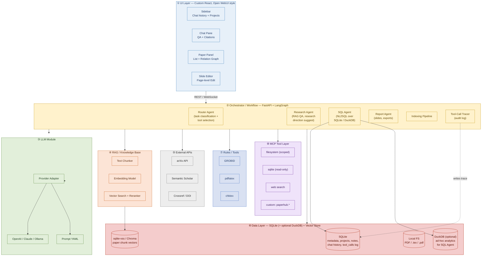
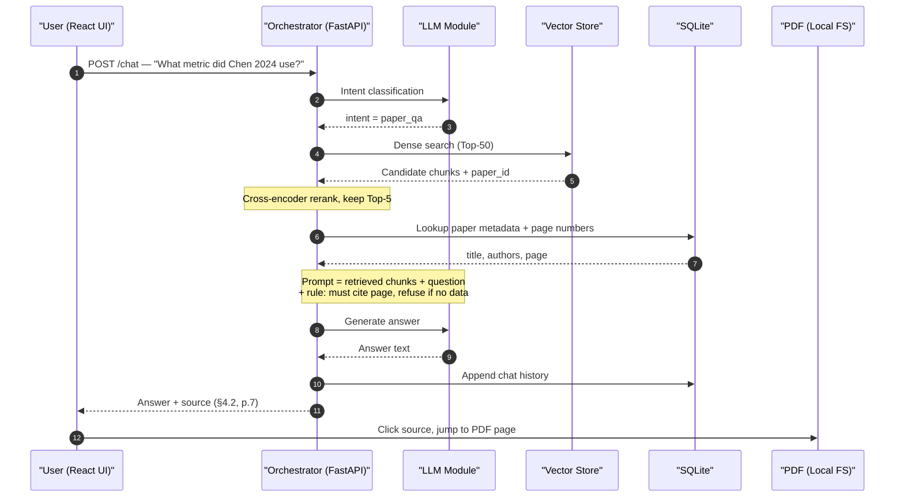

# PaperHub

**Paper Knowledge Base & Research Assistant System**

*Software Requirements Specification (SRS) · Technology Selection · Architecture Design*

| Field | Value |
| --- | --- |
| Version | v1.2 |
| Date | May 2026 |
| Predecessor | [paper2slides-plus](https://github.com/whats2000/paper2slides-plus) |

---

## Revision History

| Version | Date | Summary |
| --- | --- | --- |
| v1.0 | 2026-05-03 | Initial release covering all three parts. |
| v1.1 | 2026-05-03 | UI switched from Streamlit to custom React (Open WebUI style); data layer simplified from four components (Postgres + Qdrant + MinIO + Redis) to two (SQLite + vector store); architecture diagrams rendered with Graphviz. |
| v1.2 | 2026-05-17 | Repositioned as a **multi-model and tool-routing AI platform**: orchestrator refactored into a Router Agent + Research / SQL / Report sub-agents; added NL2SQL over a SQLite/DuckDB demo table; added MCP tool integration (filesystem, SQLite, web search) with explicit tool descriptions and security boundaries; added traceable tool-call audit log; added a model/tool comparison evaluation harness for the final demo. |

---

# Part 1 — Software Requirements Specification

## 1. Project Background

Modern researchers must read dozens to hundreds of academic papers each year, and the relationships among them — citations, methodological lineage, topical evolution — are notoriously complex. Mainstream reference managers such as Zotero and Mendeley excel at bibliographic organization and PDF annotation, but provide no cross-paper semantic linking and no tooling for research-direction exploration. Existing academic LLM products (e.g. SciSpace, Elicit) can answer questions about a single paper, but they cannot integrate a user's personal reading history into a persistently queryable knowledge base.

This project extends the author's previous open-source work, **paper2slides-plus** (a tool that converts a single paper into a Beamer presentation), into a modular research-assistant platform. On top of the original "paper → slides" flow, **PaperHub** adds indexing, cross-paper relation analysis, semantic Q&A, research-direction suggestion, and multi-paper integrated slide generation — enabling users to complete the full research loop ("read papers → manage papers → explore directions → produce reports") inside a single system.

Beyond the research-assistant use case, PaperHub also serves as a concrete reference implementation of a **multi-model and tool-routing AI platform**. A single user task may require very different capabilities — paper retrieval, structured-database querying, report generation, or external MCP tool calls — and no single model or tool is best at all of them. PaperHub therefore exposes an explicit **Router Agent** that classifies the incoming task, picks an appropriate sub-agent (Research / SQL / Report) and the right model tier, invokes the chosen tools (vector search, NL2SQL over SQLite/DuckDB, MCP servers, LaTeX compiler), and records every routing decision in a traceable audit log. The final-demo emphasis is therefore not only on answer quality, but on **whether the agent picks the correct tool, whether the SQL it emits is executable, and whether every tool call can be reproduced from the log**.

## 2. Problem Statement

Graduate students and independent researchers commonly face the following five pain points in their literature workflow:

- **Information fragmentation.** PDFs, notes, and citation lists are scattered across multiple tools; previously-read papers are hard to relocate.
- **Invisible relationships.** Method inheritance, conceptual evolution, and dataset overlap between papers exist only in the researcher's head and cannot be queried.
- **Hard-to-explore research directions.** When entering a new field, there is no tool to help map "where the gaps lie" relative to what the user has already read.
- **Time-consuming slide preparation.** Before lab meetings or defense rehearsals, users must manually consolidate multiple papers into a single deck, with high duplication of effort.
- **LLM hallucination risk.** Asking a general-purpose LLM about paper details often results in fabricated citations or numbers — unacceptable in academic contexts.
- **Opaque tool / model selection.** When the same chat box can answer a paper-content question, run an SQL aggregation over the user's library, *and* call an external MCP tool, users (and graders) cannot tell whether the agent picked the right capability for the job, or whether a wrong answer was caused by the model, the prompt, or the wrong tool being invoked.
- **Non-reproducible agent runs.** Without a structured log of *which model / which tool / which arguments* were used at each step, multi-agent answers are impossible to audit, debug, or compare across runs.

## 3. Stakeholders and User Roles

| Role | Category | Primary Concerns |
| --- | --- | --- |
| Graduate student (primary user) | End user | Quickly locate previously-read papers; produce research progress reports; explore new directions. |
| Independent researcher / self-learner | End user | Absorb knowledge across domains; lower reading friction; organize shareable outputs. |
| Faculty advisor | Indirect user | Review the student's reading trajectory and research narrative (via exported slides). |
| System administrator | Operations | API-key management, model cost control, backup of the local SQLite file. |
| LLM / Embedding providers | External dependency | Supply generation and vectorization capability (OpenAI, Anthropic, local Ollama, etc.). |
| arXiv / Semantic Scholar | External dependency | Provide paper metadata, PDFs, and citation graph data. |

## 4. Use Cases

### UC-1: Add a paper and build its index

A master's student in NLP, Alex, sees a new paper about RAG evaluation on arXiv. He pastes the link into PaperHub. The system automatically downloads the PDF, extracts the title and abstract, generates semantic embeddings, identifies the reference list, and returns a graph showing how this new paper relates to existing ones in his library — revealing that the paper inherits methodology from five papers he has previously read. The entire flow completes within 30 seconds.

### UC-2: Ask questions about paper details

While preparing a lab meeting, Alex wants to confirm "did the paper I read last week use BLEU or ROUGE for evaluation?" He types in the PaperHub chat: *"What evaluation metric did Chen 2024 use in their RAG paper?"* The system retrieves relevant passages via RAG, asks an LLM to compose the answer, and annotates the response with *"Source: §4.2, p.7"*. If no matching content exists in the database, the system explicitly replies "No relevant information found in the indexed papers" rather than fabricating an answer.

### UC-3: Research-direction suggestion and multi-paper slide generation

Alex needs to present his progress to his advisor next week. He opens the **Research Direction Exploration** mode in PaperHub and enters the keyword *"low-resource RAG evaluation."* Combining 12 related papers from his library, the system lists three sub-topics that remain under-explored and tags the key papers supporting each. Alex picks the three most promising and clicks **Compose Slides**. The system invokes the summarization, structure-planning, and Beamer-generation modules in sequence, and within 10 minutes produces a 15-page PDF deck containing background, a three-paper comparison table, identified research gaps, and a reference page.

### UC-4: Natural-language statistics over the library (NL2SQL)

Alex wants a quick reading-habit summary for his monthly report. He types into the same chat box: *"How many papers did I add in the past six months, broken down by primary topic? Show only topics with at least three papers."* The Router Agent classifies the question as a **structured-statistics** task and dispatches it to the **SQL Agent** instead of the RAG pipeline. The SQL Agent translates the question into a parameterized SQLite query against the `papers` and `tags` tables, executes it in read-only mode, formats the result as a small table, and replies with both the answer and the exact SQL it ran (folded under a "Show SQL" toggle). If the LLM emits invalid SQL, the system catches the database error, surfaces it to the LLM as feedback, and retries up to three times before failing loudly rather than fabricating numbers.

### UC-5: External MCP tool call with visible tool-routing trace

Alex pastes a colleague's pre-print URL into the chat and asks: *"Save this PDF to my `~/Papers/inbox` folder, then summarize section 3."* The Router Agent recognizes two sub-tasks: a **filesystem write** (handled by the MCP filesystem server) and a **paper summarization** (handled by the Research Agent). The UI's "Tool Trace" panel shows, step by step: `router → mcp.filesystem.write_file(path, bytes)` (✓ permission granted, scope = `~/Papers/inbox`), then `router → research_agent.summarize(section=3)`. Each step lists the tool name, the model used, the arguments (with secrets redacted), the latency, and the token cost. Alex can replay any single step in isolation for debugging, and the entire trace is persisted to the audit log table so the run is reproducible after the fact.

## 5. Functional Requirements

| ID | Name | Description |
| --- | --- | --- |
| **FR-01** | Paper import and indexing | Supports three import methods: arXiv ID, DOI, and local PDF. The system automatically performs download, text extraction, section chunking, embedding, and metadata ingestion. |
| **FR-02** | Cross-paper relation analysis | Computes a relation strength score along three dimensions — citation, semantic similarity, and author overlap — and renders the result as an interactive graph. |
| **FR-03** | Paper-detail Q&A (RAG) | Accepts natural-language questions, retrieves relevant passages, and generates answers with cited sources. |
| **FR-04** | Research-direction suggestion | Analyzes the topic distribution of the user's library, identifies research gaps, and outputs 3–5 candidate directions with supporting papers. |
| **FR-05** | Multi-paper integrated slides | Given N selected papers (default cap: 5), generates a Beamer slide deck covering background, paper comparison, research gaps, and conclusions, then compiles to PDF. |
| **FR-06** | Tagging and project management | Users can create multiple research projects; each paper can be tagged, annotated, and assigned a reading status (unread / skimmed / deeply read). |
| **FR-07** | Interactive slide editing | Inherits the page-level editing mechanism from paper2slides-plus, allowing the user to regenerate or fine-tune individual slides with on-the-fly recompilation. |
| **FR-08** | Router Agent and task classification | A dedicated Router Agent classifies every incoming user task into one of a fixed set of intents (`paper_qa`, `library_stats`, `research_suggest`, `slides`, `mcp_tool`, `chitchat`), selects the matching sub-agent (Research / SQL / Report / Slide / MCP), and picks a model tier (small for routing/classification, flagship for generation). Classification confidence below a threshold falls back to asking the user to disambiguate. |
| **FR-09** | NL2SQL over the local library | The SQL Agent translates natural-language statistical questions ("how many papers about X in the past 6 months", "top 5 most-cited authors in my library") into parameterized SQL against the SQLite metadata schema (and optionally DuckDB for ad-hoc analytics). Queries execute in a **read-only** connection. The emitted SQL, the row count, and the execution time are surfaced in the UI; invalid SQL triggers a self-repair loop (max 3 retries). |
| **FR-10** | MCP tool integration | The system exposes MCP-compatible tools to the agents — at minimum: `filesystem` (sandboxed to a user-configured root), `sqlite` (read-only over the metadata DB), and `web_search`. Each tool ships with a structured description (purpose, arguments schema, scope/permission boundary). A custom MCP server demonstrating PaperHub-specific tools (e.g. `paperhub.find_related`) is also provided. |
| **FR-11** | Tool-call audit log and trace UI | Every agent step persists `(run_id, step_index, agent, tool, model, args_redacted, result_summary, latency_ms, token_in, token_out, status, error)` to a `tool_calls` SQLite table. A "Tool Trace" panel in the UI renders the full DAG for any run, supports single-step replay, and exports the trace as JSON for grading / reproducibility. |
| **FR-12** | Model and tool evaluation harness | A built-in evaluation harness runs a fixed task suite (paper_qa / library_stats / mcp_tool / mixed) across configurable model × tool-routing combinations, scoring: (a) routing accuracy vs gold labels, (b) answer correctness, (c) source-citation rate, (d) SQL executability, (e) end-to-end latency and cost. Results are emitted as a comparison table for the final demo. |

## 6. Non-Functional Requirements

| ID | Category | Concrete Targets |
| --- | --- | --- |
| **NFR-01** | Performance | Single-paper indexing completes within 60 seconds; RAG Q&A first-token latency < 5 s; slide generation < 15 minutes. |
| **NFR-02** | Reliability | LaTeX compilation failures trigger an automatic feedback loop (max 3 retries); external API calls use exponential-backoff retry. |
| **NFR-03** | Extensibility | LLM providers must be pluggable (OpenAI, Anthropic, local Ollama); front-end and back-end are decoupled via REST so each can be replaced independently. |
| **NFR-04** | Data security | API keys are injected via environment variables only; the SQLite database is stored on the user's local machine and can be backed up in one click; no mandatory cloud dependency. |
| **NFR-05** | Usability | React UI in Open WebUI style (left: chat history sidebar; center: chat pane); bilingual zh-TW / en; no main feature is more than three clicks away. |
| **NFR-06** | Maintainability | Modular architecture with clear function boundaries; prompts centrally managed in YAML and independently versioned. |
| **NFR-07** | Cost control | Full pipeline cost per paper (index + slides) target ≤ USD 0.30; a usage dashboard is provided. |
| **NFR-08** | Routing accuracy | On a held-out task-classification set of ≥ 30 labeled prompts spanning all intents, Router Agent top-1 accuracy ≥ 75% (stretch goal: 85%). Calls that would invoke a *destructive* tool (e.g. filesystem write) outside its declared scope must be rejected by the orchestrator — this is enforced by rules, not by routing accuracy. |
| **NFR-09** | Auditability / reproducibility | Every chat turn produces a `run_id`; the full tool-call trace for any past `run_id` must be reconstructable from SQLite alone. Argument fields containing API keys or absolute home-directory paths are redacted before persistence. |
| **NFR-10** | MCP security boundary | Each MCP tool declares an explicit allow-list (filesystem root, table allow-list, URL domain allow-list). Calls outside the declared scope are rejected by the orchestrator *before* reaching the MCP server. |
| **NFR-11** | Strict typing | All Python interfaces — FastAPI request/response models, agent state, LangGraph node I/O, tool argument schemas, LLM structured outputs, and the `tool_calls` trace record — are declared with **Pydantic v2 `BaseModel`** (for validated runtime payloads) or **`TypedDict` / `dataclass`** (for in-process state). Use of `Any`, `object`, untyped `dict`, or bare `list` in public function signatures and module-level interfaces is **prohibited**; `dict[str, Any]` is allowed only at the I/O boundary with an external untyped source (e.g. a raw HTTP body) and must be parsed into a typed model before crossing one function call. The codebase passes `mypy --strict` (or `pyright` strict mode) in CI; new code that introduces `Any` is rejected. |

## 7. Out of Scope

To keep the system's positioning clear and engineering effort focused, the following are explicitly **excluded** from this release:

- **No ghostwriting.** The system does not write paper sections on the user's behalf; it only summarizes, organizes, and inspires.
- **No active crawling.** The system does not autonomously fetch new arXiv papers for recommendation; users must import manually.
- **No experiment reproduction.** The system does not execute paper code or rerun experiments; all "data" comes from the paper text itself.
- **No peer review.** The system does not score papers for quality or rank them by academic value, to avoid bias.
- **No real-time multi-user collaborative editing.** Slide editing is single-user; Google-Docs-style live collaboration is not supported.
- **No paywall bypass.** The system processes only PDFs the user lawfully possesses and open-access papers.
- **No enterprise-grade database stack.** This release deliberately avoids PostgreSQL, MinIO, Redis, etc.; the data layer is a single SQLite file plus a vector store, to keep deployment frictionless.

## 8. Acceptance Criteria

The following criteria correspond to FR-01 through FR-12; all must pass for delivery:

1. Given 10 arXiv IDs imported in batch, 95% complete indexing within 60 seconds, with metadata and embeddings persisted in SQLite.
2. The relation-analysis feature, evaluated on 50 papers, identifies at least 80% of human-annotated relations (using citation links as ground truth).
3. On a 30-question RAG Q&A test set, answer accuracy ≥ 85%, with page-level source citation in 100% of answers; 100% refusal rate on out-of-database questions.
4. Run on three different topical subsets, the research-suggestion feature produces 3–5 directions each; ≥ 70% are rated "reasonable" by a domain expert.
5. Given three input papers, the integrated-slide feature successfully compiles to PDF with at least four sections: cover, background, paper comparison, conclusions.
6. The project-management UI handles ≥ 5 simultaneous projects; tag and note operations complete within 1 second.
7. Per-slide recompilation finishes within 30 seconds and does not affect other slides.
8. On the held-out routing test set (≥ 30 labeled prompts spanning all intents), Router Agent top-1 accuracy ≥ 75%; out-of-scope MCP calls (e.g. filesystem write outside the configured root) are rejected by the orchestrator in 100% of attempted cases.
9. On a 10-question NL2SQL test set, ≥ 70% of generated queries are executable on first attempt and ≥ 85% after the self-repair loop; for the executable subset, numeric answers match the gold result row-for-row.
10. At least three MCP tools are demonstrably callable end-to-end (filesystem write, sqlite read, web search); the demo includes at least one explicitly out-of-scope call that the orchestrator rejects.
11. For each demo run, the Tool Trace UI renders the full step DAG and exports it as JSON; replaying any single read-only step (e.g. retrieval, SQL query) in isolation reproduces the same `result_summary`.
12. The evaluation harness produces a side-by-side comparison table across at least two model tiers × two routing strategies, reporting routing accuracy, answer correctness, SQL executability, latency, and cost per task.

---

# Part 2 — Technology Selection Analysis

While LLMs are at the heart of this system, the implementation must clearly partition tasks into *"suitable for LLM,"* *"better solved by rules,"* and *"only solvable with RAG."* Blindly delegating every task to a single LLM leads to hallucination, runaway cost, and unpredictable behavior. This section addresses the three required questions.

## 1. Where can we NOT rely on LLMs alone? Why?

### (1) Paper metadata extraction and normalization

Paper titles, authors, DOI, arXiv ID, and publication year are **structured information**. Asking an LLM to extract authors directly from raw PDF text introduces several failures:

- **Non-determinism.** The same PDF may yield different author orderings across temperature settings or model versions.
- **Cost waste.** Calling the LLM on every paper for a strongly rule-based ETL task amounts to paying tokens for something a regex handles for free.
- **Lack of verifiability.** An LLM cannot guarantee a valid DOI shape (`10.xxxx/yyyy`); a regex can.

**Correct approach:** use GROBID, the Crossref API, and the arXiv API to obtain structured metadata directly; fall back to LLM only when those tools fail.

### (2) Citation network and relation computation

"Does paper A cite paper B?" is a discrete, exactly-determinable fact. It should be resolved by querying the Semantic Scholar Citation API or by parsing the PDF reference list — not by asking an LLM to "judge." Likewise, LLMs cannot replace graph algorithms (PageRank, community detection) for citation-network analysis.

### (3) Numerical and statistical operations

The Research-Direction Suggestion feature requires statistics such as *"what fraction of papers I added in the past six months use BERT-family models?"* LLMs are notoriously unreliable at precise counting. These queries should be handled by SQL (in our case, SQLite) or vector-store metadata filters. The LLM should only translate the user's natural language into a query, while the database guarantees correctness.

### (4) LaTeX compilation and syntax validation

After Beamer slides are generated, they must be compiled with `pdflatex`. Compiler error messages are deterministic and machine-parseable — they should be the ground truth, with `chktex` as a linter feeding errors back to the LLM for repair. This is exactly the feedback loop in paper2slides-plus. If we instead let the LLM "self-reflect" on whether its LaTeX is correct, there will be blind spots where the model believes the code is fine but `pdflatex` still fails.

## 2. Where should we use RULES instead?

| Scenario | Rule-based approach | Why it beats an LLM |
| --- | --- | --- |
| **arXiv ID format validation** | Regex `^\d{4}\.\d{4,5}$` | 100% accurate, zero cost, millisecond latency. |
| **PDF text extraction** | PyMuPDF + pdffigures2 | OCR and layout analysis are mature fields; LLMs are weak at handling binary content. |
| **Section structure splitting** | Split by LaTeX `\section` markers or PDF heading style | Structure is an inherent property of the document; no inference needed. |
| **Paper deduplication** | DOI / arXiv ID as primary key, SHA-256 as fallback | Exact match is 1000× cheaper than semantic comparison by LLM. |
| **Authorization checks** | SQLite `WHERE user_id = ?` filter | Security must be deterministic; a probabilistic model has no place here. |
| **Slide page-count and cost guardrails** | Fixed limits: ≤ 5 papers, ≤ 20 pages per run | Rules make cost predictable; prevent a single request from burning hundreds of dollars. |
| **LaTeX syntax checking** | chktex + pdflatex | The compiler is ground truth; LLM self-reflection misses errors. |

**Principle:** any task with a single correct answer that can be deterministically judged and must be auditable should be handled by rules. LLMs are reserved for tasks requiring semantic understanding, where multiple acceptable outputs exist and creativity matters more than exactness — e.g. drafting summaries, organizing slide structure, suggesting research directions.

## 3. What goes wrong if we don't use RAG?

In PaperHub, paper-detail Q&A and multi-paper integration are both heavily RAG-dependent. If we removed RAG — either stuffing entire papers into the LLM context or relying on the model's parametric knowledge — the following five-layer breakdown occurs.

### (1) Severe hallucination

General-purpose LLMs are pre-trained on many public papers but know nothing about *"what §4.2 of a specific paper in the user's library says."* Without RAG to supply concrete context, the model will stitch together a plausible but wrong answer based on the field's "average paper" — a fatal flaw in academic settings, where citing a fabricated number directly damages credibility.

### (2) Inability to handle new papers

LLMs have knowledge cutoffs. A paper published in 2026 cannot be in the training data. Without RAG, users cannot ask about any paper that is newer than the model — impossible in fast-moving fields like AI research itself.

### (3) Context-window and cost blow-up

The naive alternative — stuff the entire paper into the prompt — fails on scale. A 30-page paper is ~25,000 tokens; integrating five papers means ~125,000 tokens per call. At mainstream input prices of USD 3–15 per million tokens, each Q&A burns tens of cents. RAG narrows the retrieved context to 1,000–3,000 tokens, cutting cost 30–100× and dramatically speeding up responses.

### (4) No source attribution

If the LLM simply says *"this paper uses BLEU,"* the user has no way to verify. RAG forces the system to first retrieve concrete passages and then generate an answer grounded in those passages, so it can append a citation like *"Source: §4.2, p.7."* For academic use this is not a nice-to-have — it is a baseline requirement.

### (5) Loss of personalization

The core value of PaperHub is "the papers *I* have read." Without RAG, the system cannot turn the user's reading history into a queryable knowledge source; the Research-Direction Suggestion feature would degenerate into a generic LLM's lecture about popular topics, completely disconnected from the user's real research trajectory.

**Summary.** RAG is not an optional optimization — it is a core architectural decision. Without it, PaperHub would devolve from a personal research assistant into yet another generic ChatGPT wrapper.

---

# Part 3 — System Architecture Design

The system adopts a seven-layer modular architecture, each layer with a single responsibility. This release targets a personal, single-machine deployment, so the data layer is deliberately reduced to two components — **SQLite + vector store** — avoiding enterprise-grade dependencies (PostgreSQL, MinIO, Redis) to keep deployment and maintenance overhead minimal.

The orchestrator layer is organized as a **Router Agent + specialized sub-agents** pattern (Research / SQL / Report / Slide), implemented on top of LangGraph (with Google ADK considered as an alternative). The Router Agent owns task classification and tool selection; each sub-agent owns a narrow capability and a fixed tool palette. All tool calls — internal pipelines, NL2SQL queries, and external MCP tools — flow through a single instrumentation point that records a structured trace to the `tool_calls` SQLite table, making every run reproducible and auditable.

## 1. Architecture Overview

*Figure 1. PaperHub system overview: an eight-block modular architecture (seven core layers + the MCP tool layer). The orchestrator is decomposed into a Router Agent + Research / SQL / Report sub-agents, with a Tool-Call Tracer writing every step to the SQLite audit log. The data layer uses a minimalist design — SQLite (+ optional DuckDB) + vector store.*

## 2. Layer-by-layer Responsibilities

### ① UI Layer — Custom React, Open WebUI style

A custom React chat interface modeled after Open WebUI's layout: a left sidebar holding chat history and project switching, a central chat pane for Q&A, plus dedicated panels for the paper list and the relation graph. We chose to build a custom UI rather than reuse Open WebUI directly because PaperHub's core needs — the paper relation graph, the slide page-level editor, and clickable inline citations that jump to PDF pages — fall outside Open WebUI's standard feature set. Building it ourselves preserves maximum flexibility. The planned stack is **React + Vite + Tailwind CSS**, communicating with the backend via REST / WebSocket.

- **Sidebar.** Chat history, project switcher, paper-list entry; follows Open WebUI's collapsible style.
- **Chat pane.** Natural-language Q&A, streaming responses, clickable inline citations that jump to the PDF.
- **Paper panel.** Cytoscape.js-rendered relation graph; clicking a node reveals abstract and notes.
- **Slide editor.** Inherits paper2slides-plus's page-level editing flow, supporting Beamer regeneration with live preview.

### ② Orchestrator / Workflow — Router Agent + sub-agents

The system's brain. **FastAPI** exposes the external interface, and **LangGraph** manages multi-step workflows internally (Google ADK is a drop-in alternative considered). The orchestrator is decomposed into one Router Agent and several narrowly-scoped sub-agents, so the routing decision is always explicit and auditable rather than buried inside a monolithic prompt.

- **Router Agent.** Classifies each incoming task into one of a fixed intent set (`paper_qa`, `library_stats`, `research_suggest`, `slides`, `mcp_tool`, `chitchat`), picks the matching sub-agent and a model tier (small for routing/classification, flagship for generation), and emits a structured `routing_decision` event into the trace log. Low-confidence classifications fall back to asking the user to disambiguate.
- **Research Agent.** Owns the RAG Q&A pipeline (retrieval → rerank → grounded generation → source annotation) and the research-direction-suggestion pipeline (topic clustering → gap analysis → recommendation).
- **SQL Agent.** Owns the NL2SQL pipeline. Holds the schema of the SQLite metadata DB (and optionally a DuckDB analytics view), translates natural-language statistical questions into parameterized SQL, runs them on a **read-only** connection, and self-repairs on syntax / runtime errors (≤ 3 retries).
- **Report Agent.** Owns the slide pipeline: structure planning → per-page generation → LaTeX compile → failure feedback loop (≤ 3 retries) → emit PDF. Also handles other export formats (Markdown, JSON trace export).
- **Indexing pipeline.** Validate ID → download PDF → extract text → chunk → embed → ingest → compute relations. Triggered by the Research Agent or directly by the user (not via the Router).
- **Tool-Call Tracer.** A cross-cutting instrumentation point sitting in front of every model call, tool call, and MCP call. Persists `(run_id, step_index, agent, tool, model, args_redacted, result_summary, latency_ms, token_in, token_out, status, error)` to the `tool_calls` SQLite table — this is the single source of truth for the Tool Trace UI and the evaluation harness.

### ③ LLM Module

Encapsulates all interaction with large language models. A **Provider Adapter** pattern lets upper layers call a uniform `generate(prompt, model_tier)`; the adapter routes to OpenAI, Anthropic Claude, or local Ollama as needed. Prompts are centrally stored in `prompts/config.yaml` (inherited from paper2slides-plus) and can be versioned and A/B-tested independently.

- **Tiered models.** Lightweight tasks (intent classification, metadata fix-up) use small models; generative tasks (slides, research suggestions) use flagship models.
- **Cost guardrails.** Every call estimates token usage in advance and rejects the request if the quota would be exceeded, surfacing the issue to the UI.

### ④ RAG / Knowledge Base

The system's memory core. Each imported paper is split into 500–1000-token chunks, vectorized by an embedding model, and stored in the vector store. Retrieval is two-stage to balance speed and precision:

1. **Stage 1.** Dense-vector search returns the top-50 candidate chunks in milliseconds.
2. **Stage 2.** A cross-encoder reranker reorders the top-50 and selects the top-5 to feed into the LLM.

The vector store's metadata filter supports filtering by user, project, and paper ID, ensuring User A never retrieves papers uploaded by User B.

### ⑤ External APIs

All adapters for external data sources and model providers are concentrated here.

- **arXiv API.** Retrieve PDF and LaTeX source by arXiv ID.
- **Semantic Scholar API.** Citation links, citation counts, related works by the same author.
- **Crossref API.** Reverse-lookup metadata by DOI.
- **LLM provider APIs.** OpenAI, Anthropic, and local Ollama (via OpenAI-compatible interface).

### ⑥ Data Layer — Two-component minimalist design

The data layer is deliberately minimal: all structured data (accounts, projects, paper metadata, tags, notes, chat history) live in a **single SQLite file**, while paper-chunk embeddings live in a **vector store** (recommended: `sqlite-vss` or an embedded Chroma). Large binary files (PDF originals, generated `.tex` and `.pdf`) sit on the local filesystem; SQLite stores only their relative paths. Three benefits:

- **Zero deployment cost.** No database server to spin up; the entire system runs on a single machine and backup is just copying one `.db` file.
- **Sufficient for personal scale.** A single SQLite file easily handles a million rows — well beyond a single researcher's annual reading volume.
- **Vector store is independently upgradeable.** If the library grows past tens of thousands of papers, swap `sqlite-vss` for Chroma or Qdrant without touching the main schema.

| Component | Purpose | Example Contents |
| --- | --- | --- |
| SQLite | Structured metadata | User accounts, projects, paper metadata, tags, notes, chat history, citation edges. |
| Vector store (sqlite-vss / Chroma) | Vector index | Paper-chunk embeddings; metadata filters (`user_id`, `project_id`, `paper_id`, `page`). |
| Local filesystem | Binary storage | Original PDFs, extracted figures, generated `.tex` / `.pdf` decks. |

### ⑦ Rules / Tools Module

Encapsulates all deterministic tools: GROBID for structured metadata extraction from PDFs, `pdflatex` for Beamer compilation, `chktex` as the LaTeX linter. These tools output facts, not inferences, and are placed in their own layer to avoid being conflated with the LLM module.

### ⑧ MCP Tool Layer

Exposes a small, carefully-bounded set of MCP (Model Context Protocol) tools that any sub-agent can call through the Router. Every tool ships with a structured description — purpose, JSON argument schema, and an **explicit scope/permission boundary** — and the orchestrator rejects any call whose arguments fall outside the declared scope *before* the request reaches the MCP server. The same Tool-Call Tracer that records internal steps also records every MCP invocation.

| MCP Tool | Scope / Allow-list | Typical Use |
| --- | --- | --- |
| `filesystem` | A single user-configured root (default: `~/PaperHub/workspace`); read + write inside the root only | Save downloaded PDFs, export decks / trace JSON. |
| `sqlite` | Read-only connection; allow-list of safe tables (`papers`, `tags`, `notes`, `tool_calls`) | Power the SQL Agent's NL2SQL queries against the metadata DB. |
| `web_search` | Domain allow-list (arxiv.org, semanticscholar.org, doi.org); rate-limited | Light external lookup when a paper isn't in the local library. |
| `paperhub.*` (custom) | In-process; exposes `find_related`, `summarize_paper`, `compose_slides` | Lets external MCP-aware clients (e.g. Claude Desktop, Cursor) reuse PaperHub capabilities. |

The custom `paperhub.*` server demonstrates the inverse direction: PaperHub is not only an MCP *client* of external tools, but also an MCP *server* that exposes its own primitives to other AI clients — useful both as a course-demo talking point and as a path toward future integration.

## 3. End-to-End Data Flow: Q&A Pipeline

The following diagram traces a user's question — *"What metric did Chen 2024 use?"* — through intent classification, vector retrieval, source annotation, and chat-history persistence.

*Figure 2. End-to-end data flow of the Q&A pipeline. RAG-retrieved chunks, after reranking, are combined with metadata into a prompt; the LLM-generated answer is returned with cited page numbers.*

## 4. Key Architectural Decisions

| Decision | Choice | Rationale |
| --- | --- | --- |
| UI framework | Custom React + Tailwind, Open WebUI style | Paper relation graph and slide editor exceed Open WebUI's built-in capabilities; custom build maximizes flexibility. |
| Workflow orchestration | LangGraph (vs hand-written if/else) | State is visualized; retries and failure-handling are first-class; debugging is far easier. |
| Data layer | SQLite + vector store (two-component minimalist) | Sufficient for personal scale; backup is a file copy; zero ops burden. |
| Vector store choice | `sqlite-vss` primary, Chroma fallback | `sqlite-vss` co-locates with SQLite in one file — no second service to run. |
| LLM integration strategy | Provider Adapter | Provider prices fluctuate; the ability to swap on demand is essential for cost control. |
| Slide generation path | LaTeX / Beamer (inherited from paper2slides-plus) | Universal in academia; supports mathematical notation; high-quality output. |
| Agent topology | Router Agent + specialized sub-agents (Research / SQL / Report) | Makes the routing decision explicit and auditable; small classification model is cheap and easy to evaluate; sub-agents stay narrow and testable in isolation. |
| External tool protocol | MCP, with declared scope per tool | Reuses an industry-standard protocol so external clients (Claude Desktop, Cursor) can also drive PaperHub; declarative scope means security boundaries are part of the contract, not implicit in the prompt. |
| Tool-call tracing | Single `tool_calls` table in SQLite, written by a cross-cutting tracer | One source of truth for the UI trace panel and the evaluation harness; reproducibility comes for free. |
| Analytics datastore | SQLite primary, DuckDB optional for the SQL Agent | SQLite handles transactional reads/writes; DuckDB handles ad-hoc OLAP queries that the SQL Agent emits, without standing up a real warehouse. |

## 5. Differences from the Predecessor (paper2slides-plus)

PaperHub is not a from-scratch rewrite; it wraps paper2slides-plus as one of its internal modules and adds a full personal-knowledge-base architecture around it. The predecessor focused on a single transformation — "single paper → slide deck" — and PaperHub demotes that to one of several pipelines while adding five new capabilities: indexing, retrieval, Q&A, research suggestion, and multi-paper integration.

The UI and data-layer choices also diverge. paper2slides-plus used Streamlit and local files because it only needed to support a single transformation. PaperHub must persist cross-session chat history and cross-paper relations, so it adopts a custom React UI and a SQLite-backed store — yet still avoids enterprise-grade components in order to preserve the "runs on a laptop" ethos.

In short: **paper2slides-plus** answers *"how do I report on this paper?"* — a tool. **PaperHub** answers *"how do I manage my entire research journey?"* — a research companion.
